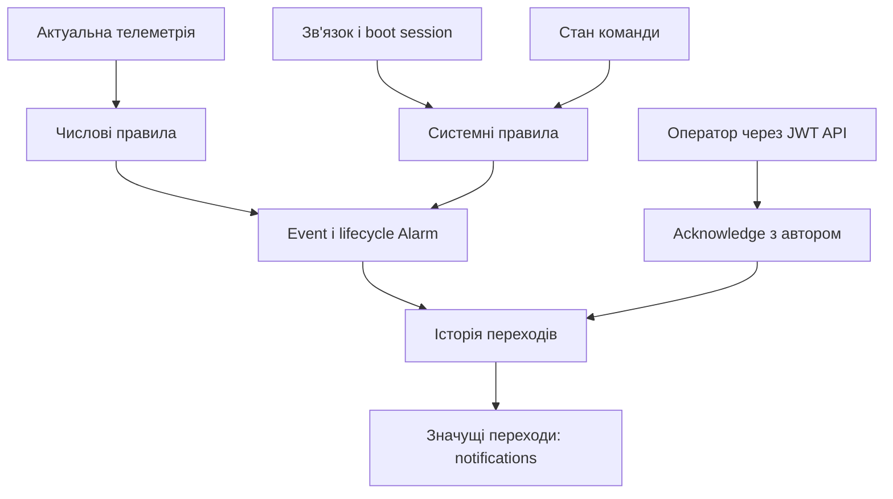
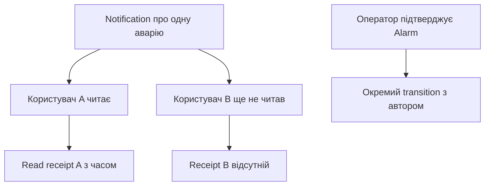

# Досьє V3.5 — Етап 7

> **Історичний запис.** Версії, числа тестів, «поточні» кроки й команди нижче належать описаному етапу. Для роботи з нинішнім кодом: [статус](project-status.md), [чинні інструкції та контракти](README.md).
## Events & Alarms Core — загальне підсумкове досьє

**Статус етапу:** завершено  
**Версія системи:** V3.5  
**Етап:** 7  
**Операції:** усі 7 операцій завершені  
**Backend після завершення:** `0.31.0`  
**Фінальна міграція:** `20260925_0015`  
**Дата завершення перевірок:** 25.09.2026  
**Дата укладання досьє:** 26.09.2026  
**Репозиторій:** `Mahone1008/STechbaza-iot`, гілка `main`

Це загальне досьє всього Етапу 7: мета, сім операцій, архітектура, код,
база даних, API, права, перевірки, межі реалізації та передача роботи до
Етапу 8. Документ складено за кодом і документацією на commit
`fabf54edc45115c5ff6b4c3c1a9304a691d4c2d7` та результатами перевірок.

Етап містить операції. Кожна операція має свою реалізацію і перевірку;
після завершення всіх семи операцій закрито Етап 7. Виправлення надійності
у версії `0.30.0` були додатковим блоком усередині цієї роботи, а не
новим Етапом 8.

## Зміст

1. Мета та результат для продукту.
2. Початковий стан і зв'язок із попередніми етапами.
3. Терміни та їхній практичний зміст.
4. Карта операцій і версій.
5. Архітектура обробки подій.
6. Модульний принцип TechBaza.
7. Модель даних і міграції.
8–14. Докладний опис операцій 1–7.
15. Додаткові виправлення надійності та доступу.
16. Транзакції, блокування й повторна доставка.
17. API та обмеження вибірок.
18. Ролі, ізоляція клієнтів і аудит.
19. Повний перевірений сценарій.
20. Автоматичні тести та GitHub Actions.
21. Локальна приймальна перевірка.
22. Повторення перевірок та експлуатаційні параметри.
23. Карта коду.
24. Джерела істини та правила для майбутнього фронтенду.
25. Межі реалізації й відкриті питання.
26. Критерії завершення Етапу 7.
27. Етап 8: шість операцій до тестової версії backend.
28. Точка продовження і порядок роботи.
29. Пов'язані документи та докази.

## 1. Мета та результат для продукту

Етап додає до вимірювань і команд зрозумілу історію проблем: що сталося,
яка проблема активна, хто її підтвердив і коли причина зникла. Дані
зберігаються в PostgreSQL і доступні через захищений API.

| Потреба користувача | Результат Етапу 7 |
|---|---|
| Побачити, що сталося з пристроєм | Журнал `DeviceEvent` із часом, джерелом і контекстом |
| Знайти активні проблеми | `DeviceAlarm` зі станом `active` або `resolved` |
| Відстежити зміну проблеми | Історія `AlarmTransition` |
| Виявити вихід показника за поріг | Налаштовувані числові правила для модулів пристрою |
| Прибрати спрацювання від коротких коливань | Підтвердження кількома показниками та різні пороги появи/зняття |
| Побачити втрату зв'язку, reboot або проблему команди | Системні події та аварії |
| Зафіксувати, що оператор побачив аварію | Acknowledge із збереженням автора |
| Побачити значущі зміни у спільній стрічці | In-app notifications через API |
| Мати особисте «прочитано» | Окремий запис прочитання для кожного користувача |

Фронтенд на цьому етапі ще не реалізовано. Підготовлено серверні дані та
дії, з яких інтерфейс зможе побудувати журнал, список аварій і повідомлення.

## 2. Початковий стан і зв'язок із попередніми етапами

Перед Етапом 7 backend мав версію `0.23.0`, база — revision
`20260925_0010`. Уже існували:

- організації, об'єкти, пристрої та призначені їм capabilities;
- MQTT ingestion, історія телеметрії та останній snapshot;
- heartbeat, online/offline і захист порядку пакетів/session;
- збережені команди з request ID, TTL, повторною доставкою, ACK та Result;
- користувачі, JWT, server-side sessions, membership і ролі;
- обмеження доступу за організаціями та історичний автор команди.

Етап 7 використав цей фундамент. Автентифікація та загальна ієрархія
Organization → Site → Device залишаються відповідальністю раніше
реалізованих компонентів. Нові Event, Alarm та notifications підключені
до тієї самої перевірки доступу.

Попередній підсумок: [Досьє Етапу 6](dossier-v3.5-stage-6-users-auth-rbac.md).

## 3. Терміни та їхній практичний зміст

| Термін | Що означає у TechBaza |
|---|---|
| Event / подія | Запис про факт: зв'язок втрачено, умова правила спрацювала, результат команди отримано |
| Alarm / аварія | Окремий інцидент, який може бути активним або завершеним |
| Transition / перехід | Запис про зміну інциденту: виник, підтверджений, завершений тощо |
| Acknowledge | Оператор підтвердив, що побачив інцидент; причина може залишатися активною |
| Resolve | Backend зафіксував зникнення умови інциденту за відповідним правилом |
| Notification | Збережене повідомлення про значущий перехід аварії |
| Read receipt | Особиста позначка прочитання повідомлення конкретним користувачем |
| Capability | Доступна можливість пристрою, наприклад читання тиску |
| Debounce | Очікування заданої кількості показників, що підтверджують появу або зникнення проблеми |
| Hysteresis / гістерезис | Різні пороги спрацювання та зняття, щоб стан не перемикався біля одного порога |
| Snapshot | Збережений набір значень на конкретний момент |
| Tenant | Організація-клієнт, у межах якої дозволено доступ до ресурсів |
| Транзакція | Пов'язані записи зберігаються разом; при помилці зміни відкочуються |
| Ідемпотентність | Повтор того самого запиту/повідомлення не створює зайвий результат у визначеному сценарії |
| Row lock | Блокування рядка PostgreSQL для впорядкування одночасних змін |
| E2E | Наскрізна перевірка кількох компонентів одним сценарієм |

### Три різні підтвердження

| Дія | Хто її виконує | Що вона доводить |
|---|---|---|
| MQTT `PUBACK` | MQTT-клієнт backend | Пакет успішно оброблено або остаточно відхилено обробником |
| Command ACK | Контролер / його симулятор | Команда прийнята; остаточне виконання ще очікується |
| Alarm acknowledge | Авторизований оператор | Людина побачила аварію |

Ці дії мають різні призначення. Прочитання notification — ще одна,
окрема дія, яка не виконує жодну команду контролера.

## 4. Карта операцій і версій

| Операція | Зміст | Версія при впровадженні | Міграція | Підсумок |
|---|---|---|---|---|
| 1 | Events & Alarms Data Model Foundation | `0.24.0` | `0011` | Завершено |
| 2 | Events API та доступ у межах клієнта | `0.25.0` | Нова не потрібна | Завершено |
| 3 | Alarm Lifecycle Service та Alarms API | `0.26.0` | Нова не потрібна | Завершено |
| 4 | Rule Engine, debounce, hysteresis, telemetry integration | `0.27.0` | `0012` | Завершено |
| 5 | System alarms: offline, reboot, command failure | `0.28.0` | `0013` | Завершено |
| 6 | Acknowledge та аудит автора | `0.29.0` | Поля вже були в `0011` | Завершено |
| Додатковий блок | MQTT/DB reliability, result timeout, доступ і конкурентні зміни | `0.30.0` | `0014` | Завершено |
| 7 | Notifications foundation та final E2E | `0.31.0` | `0015` | Завершено |

У таблиці скорочено номери міграцій; їхній повний префікс — `20260925_`.
Операцію 6 остаточно прийнято після HTTP/JWT-перевірки на `0.30.0`;
після операції 7 цю перевірку повторено на `0.31.0`.

## 5. Архітектура обробки подій



Стрілка до notifications означає фільтрацію: повідомлення створюються
для `raised`, `severity_changed` і `resolved`. Acknowledge залишається
в історії переходів та не додає notification.

Для telemetry ingestion пов'язані зміни виконуються в одній транзакції:
пакет, поточний snapshot, стан правила, Event, Alarm, transition і
notification. Системні правила також використовують спільну транзакцію
з операцією, що їх викликала.

HTTP API читає збережений стан. Він не повинен самостійно визначати, чи
зникла фізична причина аварії, на підставі натискання «прочитано».

## 6. Модульний принцип TechBaza

Правила належать конкретному `DeviceCapability.config.alarm_rules`.
Engine завантажує призначені пристрою enabled capabilities та enabled
rules. Відсутній датчик не стає обов'язковим для всіх інших пристроїв.

`alarm_type` описує вид проблеми, а `alarm_key` розрізняє конкретні
проблеми одного пристрою. Наприклад, для двох каналів тиску можуть бути
різні ключі `pressure.low:main_line` і `pressure.low:fertilizer_line`.
Це приклад адресації правил, а не твердження про готові фізичні модулі.

Вхідні telemetry keys додатково перевіряються capability policy.
Додавання нового типу датчика передбачає узгодження його контракту,
capability, firmware/simulator та майбутнього віджета. Довільний новий
ключ JSON автоматично не стає підтримуваним модулем.

Етап 7 не встановлює однакові датчики, правила чи пороги кожному клієнту.
Наведені нижче значення тиску — тестовий сценарій програмного стенда.

## 7. Модель даних і міграції

### 7.1. Основні таблиці

| Таблиця | Призначення | Ключові поля / обмеження |
|---|---|---|
| `device_events` | Факти та їхній контекст | Device, type, severity, source, occurred/received time, JSONB data |
| `device_alarms` | Стан окремого інциденту | Device, alarm key/type, state, severity, occurrence count, timestamps |
| `alarm_transitions` | Історія змін інциденту | Alarm, Event, transition type, actor snapshot, reason, data |
| `device_alarm_rule_states` | Збережений стан debounce | UNIQUE `(device_id, rule_key)`, pending action/count, останнє спостереження |
| `device_sessions` | Відомі boot sessions | PRIMARY KEY `(device_id, session_id)`, останній heartbeat sequence |
| `alarm_notifications` | Знімок значущого переходу | Organization, Device, Alarm, UNIQUE transition ID, kind, severity, title |
| `notification_reads` | Особисте прочитання | PRIMARY KEY `(notification_id, user_id)`, перший `read_at` |

Додатково у `devices` є `last_observed_session_id`, а у
`device_commands` — `result_deadline_at` і `result_timed_out_at`.

### 7.2. Міграції цього етапу

| Revision | Що змінено |
|---|---|
| `20260925_0011` | Event, Alarm, Transition, індекси та CHECK constraints |
| `20260925_0012` | Стан alarm rules у PostgreSQL |
| `20260925_0013` | Журнал boot sessions і поточна session у Device |
| `20260925_0014` | Deadline очікування Result прийнятої команди |
| `20260925_0015` | In-app notifications та персональні прочитання |

0013 переносить уже відомі telemetry sessions у журнал і встановлює
поточну session зі snapshot. 0014 задає історичним `acknowledged` командам
deadline за попереднім ACK/publish/creation time плюс 120 секунд.
Тому давня команда після оновлення може перейти в `result_unknown`.

0015 не створює повідомлення для всіх старих transitions. Стрічка
наповнюється новими значущими переходами після встановлення версії.
Попередні аварії залишаються в Alarms API.

### 7.3. Обмеження цілісності

- Event severity: `info`, `warning`, `critical`.
- Alarm і notification severity: `warning`, `critical`.
- Alarm state: `active`, `resolved`; occurrence count не менше 1.
- Один active Alarm на `(device_id, alarm_key)` — partial UNIQUE index.
- Один snapshot notification на `transition_id`.
- Один read receipt на пару notification/user.
- Pending count не може бути від'ємним; pending action — `raise`, `resolve` або null.

«Незмінна історія» тут описує поведінку application layer: штатний API
не редагує Event, transition і старі snapshots. Це не захист від прямих
дій адміністратора БД: існують зовнішні ключі з каскадним видаленням.
Архівування та довгострокова політика зберігання потребують окремої роботи.

## 8. Операція 1 — Data Model Foundation

Створено три базові сутності: факт, інцидент та історія його змін.
Зв'язок Event із переходом дозволяє пояснити, чому змінився Alarm.
Alarm зберігає його поточний стан, часові позначки і контекст.

Перевірено локально:

- застосування міграції 0011 і наявність усіх трьох таблиць;
- відхилення некоректної severity `banana` на рівні PostgreSQL;
- можливість створити перший active Alarm;
- відхилення другого active Alarm з тим самим Device/key.

У схемі transition дозволено значення `reopened`, але реалізований
lifecycle після завершення створює **новий інцидент із новим ID**.
Наявність допустимого значення в CHECK не означає готовий workflow
повторного відкриття старого рядка.

## 9. Операція 2 — Events API

Додано список подій пристрою та читання окремої події. Є фільтри за
типом, severity, source і часовим діапазоном, а також limit/offset.

Event успадковує доступ через свій Device, Site та Organization.
Перевірка `event.read` виконується для поточного користувача.

Під час локальної перевірки читались власні події, застосовувались
фільтри; чужий Event і відсутній Event давали однаковий `404`.
Публічний endpoint довільного створення Event не відкрито.

## 10. Операція 3 — Alarm Lifecycle Service

| Вхід у lifecycle | Результат |
|---|---|
| Перший raise для ключа | Новий active інцидент, occurrence count = 1, transition `raised` |
| Новий raise за наявності active | Той самий ID, count збільшується, transition `repeated` |
| Той самий Event і alarm key повторно | `duplicate_event`; лічильник повторно не збільшується |
| Нова актуальна severity | Додатковий `severity_changed` |
| Актуальне відновлення | State `resolved`, час завершення, transition `resolved` |
| Повторне resolve без active | `already_resolved`, без нового переходу |
| Recovery старіший за `last_raised_at` | `ignored_stale_resolution`, active інцидент зберігається |
| Новий raise після завершення | Новий інцидент; попередня історія зберігається |

Пізній raise для вже активної проблеми може зберегти occurrence і
transition, але не переписує її актуальний snapshot старішими даними.
Дедуплікація lifecycle за Event застосовується, коли передано `event_id`;
саме співпадіння назви проблеми не робить будь-який виклик дублікатом.

Device lock впорядковує операції, а partial UNIQUE index додатково
захищає від двох active incidents одного ключа. При читанні активної
аварії під блокуванням використовується `populate_existing=True`, щоб
ORM повернула актуальні значення після конкурентної зміни.

Локально перевірено raise/repeat/resolve, історію переходів, новий ID
після повторного виникнення і tenant isolation для читання Alarm.

## 11. Операція 4 — Rule Engine

### 11.1. Формат правила

Приклад для enabled capability `pressure.read` у тестовому пристрої:

```json
{
  "alarm_rules": [
    {
      "rule_key": "test.pressure",
      "alarm_type": "pressure.low",
      "metric": "pressure.bar",
      "source": "values",
      "kind": "low",
      "threshold": 1.0,
      "clear_threshold": 2.0,
      "debounce_samples": 2,
      "severity": "warning",
      "title": "Тест: низький тиск",
      "enabled": true
    }
  ]
}
```

Ці пороги служать для тестування. Робочі пороги конкретної установки
визначаються окремо з урахуванням її обладнання та режиму роботи.

### 11.2. Семантика порогів

| Вид правила | Спрацювання за відсутності active Alarm | Зняття active Alarm |
|---|---|---|
| `low` | Значення ≤ `threshold` | Значення ≥ `clear_threshold` |
| `high` | Значення ≥ `threshold` | Значення ≤ `clear_threshold` |

Для low clear threshold має бути вищим; для high — нижчим за threshold.
Debounce від 1 до 100 рахує підтверджувальні спостереження, а не секунди.
Зона між порогами утримує поточний стан.

### 11.3. Які дані оцінюються

- Правило читає числове поле з `values` або `state` актуального пакета.
- Rule engine запускається, коли ingestion дозволив оновлення DeviceState.
- Дублі пакетів і відхилені для snapshot старі sequence/session не переоцінюють правила.
- Відсутня metric у пакеті пропускається; автоматичної аварії «датчик зник» це не створює.
- Нечислове значення, boolean або нечислова нескінченність дають `invalid_value` і скидають pending.
- Пропуск metric сам по собі не означає reset pending; потрібна окрема політика давності даних.
- Pending state зберігається в PostgreSQL і не залежить лише від пам'яті процесу.

Engine генерує події на переходах стану. Кожен наступний низький показник
не створює новий Event і repeat. Прямий lifecycle raise підтримує repeat
для інших джерел; це інший рівень логіки.

### 11.4. Валідація конфігурації

Перевіряються формат і довжина ключів, дозволені типи, порядок порогів,
межі debounce, зайві поля та кінцевість threshold/clear threshold.
`NaN` і `Infinity` для порогів відхиляються.

Активний `rule_key` має бути унікальним серед увімкнених правил одного
Device, включно з різними capabilities. Конфлікт при призначенні або
оновленні повертає `409`. Перевірка виконується під Device lock.
Некоректну стару конфігурацію потрібно виправити явно; автоматичного
переписування раніше збережених правил не проводилось.

### 11.5. Локально перевірене

На частотному тестовому правилі пройдено normal → pending raise → active
→ pending resolve → resolved → новий incident; перевірено дублікати,
порядок sequence/session і заборону metric при вимкненій capability.
Штучний збій після запису Event/Alarm відкотив пакет, snapshot, rule state
та пов'язані записи. Пізніше операція 7 розширила цю гарантію на notification.

## 12. Операція 5 — System alarms

| Системна проблема | Коли виникає | Коли завершується |
|---|---|---|
| `device.offline` | Відомий пристрій перестав виходити на зв'язок довше timeout | Прийняте повідомлення відновлює presence |
| `device.reboot` | Після відомої boot session з'явилась нова | Наступне окреме допустиме повідомлення тієї самої нової session |
| `command.failed` | Result `failed` або закінчення delivery TTL зі статусом `expired` | Успішна новіша команда того самого типу |
| `command.result_unknown` | Після ACK не отримано Result до deadline | Отримано пізній Result саме цієї команди |

Останній рядок додано блоком `0.30.0` і включено до підсумкового стану етапу.

Offline detector не створює аварію для пристрою, який ще ніколи не
підключався. Повторні цикли не створюють нові однакові incidents.
Типові значення: 90 секунд до offline і 5 секунд між перевірками.
Фактична затримка також залежить від циклу worker, черги й навантаження.

Перша boot session встановлює початковий стан без reboot alarm.
Повторні message ID, старі heartbeat sequence та вже відомі старі
sessions не повинні імітувати новий reboot або його стабілізацію.
Heartbeat без session ID сумісний із presence, але не дає визначити reboot.

Command failure групується за типом команди: ключ
`command.failed.{command_type}`. Result timeout має ключ конкретної
команди: `command.result_unknown.{command_id}`. Пізній Result знімає
невизначеність; якщо він містить `failed`, обробка невдачі залишається
окремою від закриття timeout alarm.

`system_alarm_check` перевіряв offline/online, reboot і стару session,
failed/duplicate/successful Result та expiry, з відкатом тестових даних.

## 13. Операція 6 — Acknowledge та actor audit

`POST /api/v1/alarms/{alarm_id}/acknowledge` отримує автора з перевіреної
session і поточного контексту доступу. Клієнт не надсилає довільного
автора підтвердження.

Перше підтвердження записує в Alarm час, user ID, email і display name.
Один transition `acknowledged` додатково містить:

- `actor_user_id`;
- `actor_auth_session_id`;
- `actor_organization_id`;
- `actor_organization_role`;
- `actor_email`, `actor_display_name`;
- причину `operator_acknowledged` і час дії.

Повторний запит повертає збережений результат, зберігає першого автора
та timestamp і не додає другий transition. Для вже resolved інциденту,
який раніше не підтверджували, відповідь — `409`. Якщо підтвердження вже
було, повтор повертає його навіть після подальшого resolve.

Acknowledge не змінює active на resolved. Device lock впорядковує його
з lifecycle-операціями. Роль і session у transition — історичний snapshot,
тому подальша зміна ролі не повинна змінювати старий запис автора.

Перевірки `alarm_ack_check` та `alarm_ack_http_check` охоплюють доступ,
перший/повторний виклик, actor audit, resolved conflict і відкат даних.
HTTP-перевірка використовує справжні ASGI-маршрути та Bearer JWT усередині
тестового процесу; браузер або зовнішній HTTP-проксі до неї не входять.

## 14. Операція 7 — Notifications foundation та final E2E

### 14.1. Коли створюється повідомлення

| Transition | Запис у стрічці |
|---|---|
| `raised` | Так |
| `severity_changed` | Так, зі знімком нової severity |
| `resolved` | Так |
| `repeated` | Ні |
| `acknowledged` | Ні |
| Повтор того самого transition | Дублікат блокується UNIQUE |

Notification зберігає посилання на Organization, Device, Alarm і
Transition; kind, severity, title, description і часові позначки.
Зміна поточної аварії не переписує старий snapshot.

Для `resolved` поле severity зберігає важливість інциденту. Відновлення
позначається `kind=resolved`; майбутній UI має враховувати обидва поля.

### 14.2. Спільна історія та особисті прочитання

Стрічка належить організації. Її бачать поточні активні учасники з
`notification.read`, включно з користувачами, які приєдналися пізніше.
Персональний список адресатів на момент події не формується.

GET не змінює read status. POST read додає receipt для поточного user ID.
Повторні та конкурентні прочитання залишають один рядок і перший час.
Прочитання користувачем A не змінює непрочитані повідомлення користувача B.



### 14.3. Перенесення пристрою

Для доступу до notification мають збігатися організація snapshot і
поточна організація Device. Після перенесення Device його старі notifications
не відкриваються новій організації та виключаються з поточної стрічки старої.
Окремий процес архівного доступу або перенесення історії не реалізовано.

Це правило конкретно для notifications. Event/Alarm API прив'язують
доступ до поточної ієрархії Device; загальну політику перенесення всіх
історичних даних ще потрібно визначити перед продуктовим onboarding.

### 14.4. Гарантія запису

Lifecycle додає transition і snapshot у тій самій DB session.
`NotificationService.record_alarm_transition` не робить окремого commit
і не викликає зовнішні мережеві сервіси.

Помилка запису notification відкочує зовнішню транзакцію. Для telemetry
це перевірено після фактичного INSERT: пакет, snapshot, rule state,
Event, Alarm та notification не залишилися частково збереженими.
Повторна обробка того самого пакета після усунення штучної помилки успішна.

## 15. Додаткові виправлення надійності та доступу

| Виявлена проблема | Що реалізовано | Практичний результат |
|---|---|---|
| MQTT ACK міг піти після помилки DB processing | Manual ACK, persistent session, reconnect | Непідтверджений QoS 1 packet може надійти повторно |
| ORM могла повернути старий command status після lock | `populate_existing=True` | Рішення приймається за перечитаним станом |
| ACK без Result залишав команду в очікуванні без кінця | Result deadline та `result_unknown` | Очікування обмежено; автоматичне повторне виконання після ACK не запускається |
| Два модулі могли мати однаковий активний rule key | Перевірка під Device lock | Конфлікт відхиляється до збереження конфігурації |
| Пороги могли містити NaN/Infinity | Валідація кінцевих чисел | Некоректне правило повертає validation error |
| Глобальна діагностика була доступна без належного обмеження | Перевірка platform `superadmin` | Звичайні tenant roles не читають глобальні останні повідомлення |
| Одночасне видалення двох owner могло залишити організацію без owner | Organization lock і повторна перевірка прав | Одного останнього active owner зберігає захист |
| Стара ORM-копія Alarm могла приховати severity change | Перечитування active Alarm під lock | Зміна важливості потрапляє до історії та notifications |

Result deadline типово становить 120 секунд після першого ACK. Повторний
ACK не продовжує deadline. `result_unknown` означає невідомий фізичний
результат; він не підтверджує, що насос зупинився або що команда не виконалась.
Пізній Result може завершити команду як `succeeded` або `failed`.

Окремий звіт з виправлень: [Hardening — 25.09.2026](hardening-2026-09-25.md).

## 16. Транзакції, блокування й повторна доставка

### 16.1. Що зберігається разом

| Операція | Пов'язані зміни |
|---|---|
| Актуальна telemetry з переходом правила | TelemetryMessage, DeviceState, rule state, Event, Alarm, Transition, Notification |
| Зміна system alarm | Стан виклику presence/command та Event/Alarm/Transition/Notification |
| Перше acknowledge | Alarm acknowledged fields і один actor transition |
| Read notification | Один персональний receipt |

Lifecycle за замовчуванням може завершувати власну транзакцію.
Для спільного запису orchestration services передають `commit=False`;
commit виконує зовнішній викликач. Саме цей спосіб використовується
для telemetry/rule/system paths.

### 16.2. Межі MQTT-гарантії

Успішний commit або остаточне відхилення постійно невалідного payload
завершується MQTT ACK. При тимчасовій помилці обробки ACK не надсилається;
після reconnect брокер повторює непідтверджений пакет persistent session.

Для цього потрібні QoS 1, збережена session брокера, постійний client ID
і відповідна persistence-конфігурація. QoS 0 не дає такої гарантії.
Повторна доставка і application idempotency працюють разом; загальну
гарантію «фізична дія рівно один раз за будь-якого збою» цей етап не доводить.

Невалідний JSON, порушений контракт і постійно неприйнятні DB values
відхиляються остаточно, щоб не утворювати нескінченний цикл одного пакета.
Налаштування брокера та ідентичності реальних пристроїв залишаються
частиною підготовки до захищеного зовнішнього стенда.

### 16.3. Конкурентні операції

Device lock серіалізує lifecycle, rule evaluation та конфігурацію правил.
Organization lock використовується для membership/last-owner змін.
UNIQUE constraints і `ON CONFLICT DO NOTHING` захищають notifications
та read receipts від дублювання.

Перевірки виконувались із двома DB sessions на справжній PostgreSQL.
Це підтверджує конкретні сценарії гонок, але не є вичерпним доказом
відсутності всіх можливих конкурентних помилок.

## 17. API та обмеження вибірок

Усі шляхи таблиці мають префікс `/api/v1` і потребують Bearer JWT.

| Метод | Шлях | Permission | Призначення |
|---|---|---|---|
| GET | `/devices/{device_id}/events` | `event.read` | Події пристрою |
| GET | `/events/{event_id}` | `event.read` | Одна подія |
| GET | `/devices/{device_id}/alarms` | `alarm.read` | Інциденти пристрою |
| GET | `/alarms/{alarm_id}` | `alarm.read` | Стан одного інциденту |
| GET | `/alarms/{alarm_id}/transitions` | `alarm.read` | Історія інциденту |
| POST | `/alarms/{alarm_id}/acknowledge` | `alarm.acknowledge` | Підтвердження оператором |
| GET | `/organizations/{organization_id}/notifications` | `notification.read` | Стрічка з особистим `read_at` |
| GET | `/organizations/{organization_id}/notifications/unread-count` | `notification.read` | Особиста кількість непрочитаних |
| GET | `/notifications/{notification_id}` | `notification.read` | Один snapshot |
| POST | `/notifications/{notification_id}/read` | `notification.read` | Позначити прочитаним |

| Список | Параметри |
|---|---|
| Events | `limit` 1–200, default 50; `offset` ≥ 0; `event_type`, `severity`, `source`, `occurred_from`, `occurred_to` |
| Alarms | `limit` 1–200, default 50; `offset` ≥ 0; `state`, `severity`, `alarm_type` |
| Transitions | `limit` 1–500, default 100; `offset` ≥ 0 |
| Notifications | `limit` 1–200, default 50; `offset` ≥ 0; `unread_only`, default false |

Notifications упорядковані за `created_at DESC, id DESC`. При нових
записах між offset-сторінками клієнт має враховувати можливі повтори.
Cursor pagination і консистентний snapshot багатьох сторінок не реалізовані.

Публічних API довільного raise/resolve, редагування історії або
безпосереднього створення notification немає. Налаштування rules
використовує існуючі endpoints призначення/оновлення capabilities.

## 18. Ролі, ізоляція клієнтів і аудит

| Permission | owner | admin | operator | viewer | service |
|---|---|---|---|---|---|
| `event.read` | Так | Так | Так | Так | Так |
| `alarm.read` | Так | Так | Так | Так | Так |
| `alarm.acknowledge` | Так | Так | Так | Ні | Так |
| `notification.read` | Так | Так | Так | Так | Так |
| `capability.manage` для правил | Так | Так | Ні | Ні | Так |

Platform `superadmin` має існуючий bypass. Platform `service_admin`
потребує явного активного membership для tenant data; глобальна роль
не відкриває автоматично всі організації.

Типові результати перевірених запитів:

| Ситуація | Відповідь |
|---|---|
| Немає JWT або session відкликана | `401` |
| Ресурс іншої організації або неіснуючий ID | `404` |
| Viewer підтверджує доступну йому аварію | `403` |
| Перше acknowledge вже resolved аварії | `409` |
| Некоректні параметри, наприклад limit=0 | `422` |

Відкликання membership закриває наступні запити до організації.
Відкликання session робить старий access JWT непридатним для доступу.
Ці сценарії перевірені; окремий доказ усіх варіантів одночасного
відкликання прав під час уже розпочатої мутації не заявляється.

Глобальні `/mqtt/*`, `/health/db`, `/health/mqtt`,
`/command/reliability/status`, `/system/alarms/status` захищені перевіркою
superadmin. Публічний `/health` повертає статус процесу й версію;
він сам по собі не підтверджує працездатність усіх залежностей.

## 19. Повний перевірений сценарій

Тест використовує Mosquitto, справжню PostgreSQL, MQTT-обробник і
HTTP/JWT-маршрути через ASGI. Замість фізичного датчика — програмний
publisher; правила налаштовані на threshold 1, clear threshold 2,
debounce 2 для `pressure.bar`.

| Крок | Вхід або дія | Очікуваний і підтверджений результат |
|---|---|---|
| 1 | Тиск 0.4, sequence 1 | Pending raise, повідомлень немає |
| 2 | Тиск 0.3, sequence 2 | Active Alarm та notification `raised` |
| 3 | Повтор того самого пакета | Нового повідомлення немає |
| 4 | Тиск 0.2, sequence 3 | Та сама аварія, стрічка не дублюється |
| 5 | Viewer читає повідомлення | Персональний read receipt |
| 6 | Operator підтверджує Alarm двічі | Один acknowledge transition, однаковий перший timestamp |
| 7 | Тиск 1.5, sequence 4 | Гістерезис утримує active |
| 8 | Тиск 2.5, sequence 5 | Pending resolve |
| 9 | Тиск 2.6, sequence 6 | Alarm resolved, notification `resolved` |
| 10 | Читання історії та стрічки | Raised/acknowledged/resolved; дві notifications, одна ще непрочитана viewer |

Повідомлення raised і resolved належать тому самому інциденту.
Автор acknowledge збережений. Це фінальний програмний E2E Етапу 7;
випробування справжнього насоса до цього доказу не входить.

## 20. Автоматичні тести та GitHub Actions

### 20.1. Склад набору

| Файл | Кількість | Що перевіряє |
|---|---:|---|
| `test_hardening.py` | 14 | ACK/Result deadline, MQTT handling, rules, diagnostics, membership guards |
| `test_hardening_postgres.py` | 5 | Справжні блокування PostgreSQL, timeout/late Result, redelivery через Mosquitto |
| `test_mqtt_redelivery.py` | 1 | TCP reconnect і отримання того самого непідтвердженого packet |
| `test_notifications_postgres.py` | 8 | Lifecycle snapshots, HTTP/JWT, rollback, tenant scope, concurrency та E2E |
| **Разом** | **28** | Регресійні та інтеграційні сценарії |

Без PostgreSQL/MQTT opt-in виконуються 15 тестів, 13 пропускаються.
Такий запуск не прирівнюється до повного набору. Для повного набору
потрібні обидві змінні `TECHBAZA_RUN_DB_TESTS=1` і `TECHBAZA_RUN_MQTT_TESTS=1`.

### 20.2. Вісім перевірок notifications

1. Збереження raised/severity_changed/resolved snapshots і дедуплікація повторів.
2. Відкат усієї telemetry-транзакції після помилки запису notification.
3. JWT/HTTP permissions, персональні read/unread, pagination, відкликання membership/session.
4. Приховування історичних notifications після перенесення Device.
5. Два одночасні read дають один receipt і початковий timestamp.
6. Два одночасні raises дають один incident і одне повідомлення raised.
7. Стара ORM-копія Alarm не приховує актуальну зміну severity.
8. MQTT → rule → Alarm → notification → HTTP acknowledge → recovery.

### 20.3. Підтверджений запуск CI

[Backend checks — run 36140650684](https://github.com/Mahone1008/STechbaza-iot/actions/runs/36140650684),
commit `07298f13692c4b5b3f730377ebd107869eb157a3`:

- Python 3.13, PostgreSQL 16, Mosquitto 2;
- усі міграції від порожньої бази до 0015 пройшли;
- downgrade 0015 → 0014 і upgrade до 0015 пройшли в тимчасовій CI-базі;
- `Ran 28 tests in 3.876s` та `OK`, без пропусків;
- job `hardening` має conclusion `success`.

Перший запуск `36140447791` теж пройшов 28 тестів, але показав warning
SQLAlchemy щодо `Result.tuples()`. Його прибрано прямим розпакуванням
рядків результату; повторний запуск вище успішний.

Тривалість набору тестів не є вимірюванням пропускної здатності системи
або підтвердженням роботи з тисячами контролерів.

## 21. Локальна приймальна перевірка — 25.09.2026

Користувач виконав погоджений PowerShell-блок у Windows/Docker Compose
та надав чотири скриншоти. Перевірено commit
`2b50c9b1359fcc1c39c7cf23d79855800daf85d1`, який уже містив код із
успішного CI та документацію його результатів.

| Перевірка | Зафіксований результат |
|---|---|
| Отримання коду | Fast-forward `ba60a03 → 2b50c9b` із правильного `STechbaza-iot` |
| Збірка backend | Успішна |
| Міграція | Видно upgrade `20260925_0014 → 20260925_0015` |
| Повний набір тестів | `Ran 28 tests in 4.228s`, `OK`, без пропусків |
| HTTP acknowledge: доступ | PASS: unauthenticated/revoked 401, tenant 404, viewer 403, resolved 409 |
| HTTP acknowledge: повтор та аудит | PASS: один transition, actor/session/role збережені |
| Прибирання даних HTTP acknowledge | PASS: транзакція відкотилась, Device/Alarm/User не залишилися |
| Повторний запуск | Backend started, PostgreSQL healthy, Mosquitto running |
| `/health` | `ok / techbaza-backend / 0.31.0` |
| Завершення блоку | Фінальний зелений PASS |

На скриншоті `alembic current` обрізано рядок із його результатом.
Окремий видимий `0015 (head)` не зараховано як доказ; видно сам upgrade,
продовження блоку без помилки та повне виконання інтеграційних тестів.

Traceback `Injected temporary database processing failure` був навмисним
збоєм у тесті MQTT redelivery. Після нього відповідний тест завершився
`ok`, а підсумок усього набору — `OK`.

Ранні операції приймались поетапно; їхні локальні результати записані в
[журналі Етапу 7](stage-7-events-alarms-core.md). Для первинного приймання
операції 6 на `0.30.0` було повідомлення користувача про успіх; фінальні
скриншоти `0.31.0` окремо підтвердили повторну HTTP/JWT-перевірку.

Закриття Етапу 7 записано commit
[`fabf54e`](https://github.com/Mahone1008/STechbaza-iot/commit/fabf54edc45115c5ff6b4c3c1a9304a691d4c2d7).
Це документальний commit; він не змінював backend.

## 22. Повторення перевірок та експлуатаційні параметри

### 22.1. Відтворювана процедура

Готовий PowerShell-блок отримання коду, зупинки backend, збірки, upgrade,
28 тестів, HTTP acknowledge і повторного запуску збережено в
[Notifications foundation v1, розділ 8](notifications-foundation-v1.md#8-локальне-оновлення-одним-блоком-powershell).
Команди виконуються з кореня локального репозиторію.

Порядок має значення: спочатку зупинити backend, потім застосувати міграції
для нового коду, провести перевірки та запустити backend. Під час повного
набору тестів PostgreSQL і Mosquitto працюють, а основний backend зупинено,
щоб його workers та загальна MQTT-підписка не втручалися у тестові пристрої.

Для вже зібраної та мігрованої версії `0.31.0` повний набір запускається:

```powershell
docker compose run --rm -T -e TECHBAZA_RUN_DB_TESTS=1 -e TECHBAZA_RUN_MQTT_TESTS=1 backend python -m unittest discover -s tests -v
```

Очікування цього історичного набору — 28 тестів без пропусків. Після
майбутнього додавання тестів їхня кількість може зрости; результати слід
звіряти з документацією відповідної версії.

Автотести використовують власні тимчасові UUID та прибирають створені
дані. Частина PostgreSQL-сценаріїв робить справжній commit для перевірки
двох sessions, тому примусове переривання може залишити тестові записи.
HTTP acknowledge checker окремо перевіряє відкат своєї транзакції.

Оновлення цього досьє саме по собі не потребує повторної міграції,
перескладання образу чи повторного проходження вже прийнятого етапу.

### 22.2. Основні параметри на момент завершення

| Параметр | Значення в поточному Compose | Для чого |
|---|---|---|
| `DEVICE_ONLINE_TIMEOUT_SECONDS` | 90 | Межа давності зв'язку |
| `SYSTEM_ALARM_POLL_SECONDS` | 5 | Інтервал offline worker |
| `SYSTEM_ALARM_BATCH_SIZE` | 100 | Розмір пакета перевірки |
| `COMMAND_RETRY_INTERVAL_SECONDS` | 10 | Інтервал delivery retry до ACK за правилами TTL |
| `COMMAND_RELIABILITY_POLL_SECONDS` | 2 | Інтервал command worker |
| `COMMAND_RELIABILITY_BATCH_SIZE` | 100 | Розмір пакета command worker |
| `COMMAND_RESULT_TIMEOUT_SECONDS` | 120 за замовчуванням | Очікування Result після ACK; значення береться з env |
| `MQTT_CLIENT_ID` | `techbaza-backend` | Постійна ідентичність MQTT-клієнта backend |

Поточний запуск розраховано на один backend process із фоновими
workers. Не можна вважати запуск кількох копій із тим самим MQTT client ID
готовою схемою горизонтального масштабування. Координація workers і
розподіл MQTT-споживання потребують окремого рішення.

### 22.3. Межі відкату міграцій

Downgrade 0015 видаляє таблиці notifications і receipts разом з їхніми
даними. Перевірений CI-відкат виконувався у тимчасовій базі; він не є
доказом безпечного відкату заповненої клієнтської бази. Відновлення з
резервної копії й процедура оновлення з реальними даними належать Етапу 8.

## 23. Карта коду

| Частина | Основні файли |
|---|---|
| Event/Alarm/Transition | `backend/app/models/event_alarm.py` |
| Стан правил і sessions | `backend/app/models/alarm_rule_state.py`, `backend/app/models/device_session.py` |
| Notifications/receipts | `backend/app/models/notification.py` |
| Lifecycle | `backend/app/services/alarms.py` |
| Числові правила | `backend/app/services/alarm_rule_engine.py`, `backend/app/schemas/alarm_rule.py` |
| Системні аварії | `backend/app/services/system_alarms.py`, `backend/app/services/system_alarm_worker.py` |
| Запис і прочитання повідомлень | `backend/app/services/notifications.py` |
| SQL-доступ | `backend/app/repositories/events.py`, `alarms.py`, `alarm_rules.py`, `notifications.py` у тій самій папці |
| Telemetry/presence integration | `backend/app/services/telemetry.py`, `backend/app/services/device_presence.py` |
| Command integration | `backend/app/services/command_ack.py`, `command_result.py`, `command_dispatch.py`, `command_reliability.py` у тій самій папці |
| MQTT handling/reconnect | `backend/app/mqtt_client.py` |
| HTTP endpoints | `backend/app/api/v1/events.py`, `alarms.py`, `notifications.py` у тій самій папці |
| Права й ресурсні guards | `backend/app/security/roles.py`, `backend/app/security/authorization.py` |
| Глобальна діагностика | `backend/app/security/diagnostics.py`, `backend/app/main.py` |
| Міграції | `backend/alembic/versions/20260925_0011_*` … `20260925_0015_*` |
| Локальні checkers | `backend/app/tools/alarm_ack_check.py`, `alarm_ack_http_check.py`, `system_alarm_check.py` у тій самій папці |
| Перевірка транзакції rule engine | `backend/app/tools/telemetry_rule_transaction_check.py` |
| Lifecycle simulator | `backend/app/tools/alarm_lifecycle_simulator.py` |
| Автотести | `backend/tests/test_hardening.py`, `test_hardening_postgres.py`, `test_mqtt_redelivery.py`, `test_notifications_postgres.py` |
| CI | `.github/workflows/backend-checks.yml` |

## 24. Джерела істини та правила для майбутнього фронтенду

| Питання | Звідки брати відповідь |
|---|---|
| Які можливості встановлено? | Призначення DeviceCapability і каталог capabilities |
| Які вимірювання останні? | DeviceState та timestamps |
| Чи є зв'язок? | Presence/availability і `last_seen_at` |
| Що сталося? | DeviceEvent |
| Яка проблема активна? | DeviceAlarm.state |
| Хто підтвердив? | Alarm acknowledged fields і actor snapshot transition |
| Як змінювався інцидент? | AlarmTransition |
| Яке повідомлення створене тоді? | AlarmNotification snapshot |
| Чи прочитав саме цей користувач? | NotificationRead |
| Чи виконана команда? | DeviceCommand і фактичний Result |

Для реалізації інтерфейсу слід зберегти такі правила:

1. Віджети й команди залежать від реальних enabled capabilities пристрою.
2. Показник має супроводжуватись часом; відсутнє або старе значення не можна видавати за свіже.
3. Acknowledged active Alarm залишається активною проблемою.
4. Прочитане повідомлення не означає acknowledge.
5. Resolved notification позначає завершення навіть при severity `critical`.
6. Command ACK ще не підтверджує фізичне виконання.
7. `result_unknown` слід показувати як невизначений результат, а не як успішну зупинку.
8. Право на дію перевіряє backend; приховування кнопки у браузері лише доповнює цей захист.
9. Довільний historical ID не повинен обходити перевірку tenant.
10. In-app feed зараз доступний через HTTP API; готової WebSocket/SSE-доставки цей етап не додає.

## 25. Межі реалізації й відкриті питання

| Напрям | Статус після Етапу 7 |
|---|---|
| Events/Alarms lifecycle та API | Реалізовано й перевірено в описаних сценаріях |
| Числові low/high rules | Реалізовано для підтриманих metrics і enabled capabilities |
| Offline/reboot/command alarms | Реалізовано й перевірено на програмному стенді |
| In-app notifications і read receipts | Реалізовано й перевірено |
| Telegram/email/SMS/push | Не реалізовано в цьому етапі |
| Адресати, preferences, retry зовнішніх провайдерів | Окремий майбутній блок |
| Фронтенд журналу, аварій і повідомлень | Запланований після підготовки тестового backend |
| Загальний постійний демонстраційний стенд | Потрібно зібрати з наявних інструментів і доповнень |
| Політика архівації, очищення історії та обмеження обсягу | Окрема робота |
| Давність кожного датчика та missing-data alarms | Окрема політика; відсутня metric не створює sensor failure автоматично |
| Зміна/вимкнення правила під час active Alarm | Продуктову політику потрібно уточнити; вимкнення не слід трактувати як усунення причини |
| Передача пристрою іншому клієнту разом з історією | Загальний workflow не завершено |
| Підтримка довільних fault codes/нових типів модулів | Потрібні конкретні контракти й реалізація джерел подій |
| Перевірка повного ланцюжка на фізичному ESP32/VFD | До результатів цього етапу не зарахована |
| MQTT TLS, облікові дані пристроїв і topic ACL | Підготовка захищеного зовнішнього стенда |
| Production HTTPS/secrets, monitoring, автоматичні backups | Окремий deployment-блок |
| Тривалі та навантажувальні випробування | Ще не підтверджені |
| Масштаб 10 000 контролерів | Не доведено поточним набором тестів |

Cloud Alarm є засобом обліку та реагування. У цьому етапі він не
реалізує автоматичний аварійний stop обладнання і не доводить наявність
локальних захистів у firmware або VFD.

Закриття етапу означає виконання його визначеного обсягу, а не
відсутність усіх майбутніх дефектів або завершення всього продукту.

## 26. Критерії завершення Етапу 7

| Критерій | Підтвердження |
|---|---|
| Модель Event/Alarm/Transition та DB constraints | Міграція 0011 і локальні перевірки операції 1 |
| Tenant-scoped Events API | Локальні own/foreign/missing сценарії операції 2 |
| Повний базовий lifecycle | Raise/repeat/resolve/new incident і read API, операція 3 |
| Налаштовувані правила та антидублювання | Локальна операція 4, регресії й фінальний MQTT E2E |
| System alarms | `system_alarm_check`, операція 5 |
| Acknowledge з історичним автором | Service checker та HTTP/JWT checker, операція 6 |
| Атомарна in-app стрічка | Вісім нових integration tests, операція 7 |
| Виправлення reliability/security | Регресійний набір і PostgreSQL/MQTT scenarios |
| Повний автоматичний набір | 28 tests OK без пропусків у CI та локально |
| Робочий запуск після оновлення | Локальний `/health`: backend `0.31.0` |
| Приймання користувачем | Поетапні підтвердження та фінальні скриншоти |
| Документування закриття | Журнал етапу, notifications report і це загальне досьє |

**Усі сім операцій завершені. Етап 7 закрито 25.09.2026.**

## 27. Етап 8 — шість операцій до тестової версії backend

Це погоджений у чаті план наступної роботи. Досьє Етапу 7 фіксує його
як передачу контексту; реалізація операцій Етапу 8 тут не зараховується.

Назва: **«Підготовка тестової версії backend»**.

| Операція Етапу 8 | Зміст | Що потрібно підтвердити перед закриттям |
|---|---|---|
| 1. API для фронтенду | Закріпити запити/відповіді перших екранів, права, помилки та модульний склад | Перші екрани мають узгоджений API; прогалини явно записані або усунені |
| 2. Авторизація в браузері | Порядок доступу, зберігання/оновлення токенів, завершення session, підключення frontend origin і захист входу | Успішний вхід, expiry/refresh/logout та відмова після revoke відтворюються |
| 3. Панель і графіки | Історія за період, обмеження кількості точок, відсутні/застарілі дані | Вибірки мають передбачуваний розмір і коректні часові межі |
| 4. Демонстраційний стенд | Різні користувачі, дві організації, пристрої з різними capabilities, постійний simulator | Сценарії вимірювань, команд і аварій повторюються без фізичного обладнання |
| 5. Комплексні перевірки | Повні користувацькі сценарії, ізоляція, повторні команди, обриви й перезапуски | Виявлені дефекти виправлені й захищені регресіями |
| 6. Приймання тестової збірки | Чиста установка, оновлення, backup/restore, інструкції та відомі обмеження | Користувач відтворив запуск і погоджений загальний сценарій |

Після завершення всіх шести операцій закривається Етап 8.
Контрольна точка: **backend готовий до підключення й тестування фронтенду**.
Наступний запланований Етап 9 — фронтенд; його операції визначаються
окремо перед початком.

Цей план не переносить у статус «готово» зовнішні канали повідомлень,
B2B/QR onboarding, subscriptions, production deployment чи фізичний
пілот. Вони зберігають окремі критерії готовності.

## 28. Точка продовження і порядок роботи

1. Етап 7 закритий; базова версія для продовження — backend `0.31.0`, migration 0015.
2. Наступна функціональна робота — Етап 8, операція 1: API для перших екранів.
3. Репозиторій — `Mahone1008/STechbaza-iot`; робота ведеться безпосередньо в `main` за погодженням користувача.
4. Перед кожним блоком пояснюються його мета, терміни й очікуваний результат.
5. Після змін користувач отримує один достатньо великий, пов'язаний PowerShell-блок із перевіркою помилок.
6. Користувач надсилає результат/скриншот або «є» / «есть», якщо виконано з очікуваним результатом.
7. Операція закривається після розбору результату; статус записується в документації.
8. Після всіх операцій закривається відповідний етап і складається його досьє.

Поточне доповнення загального досьє є документальною роботою після
приймання Етапу 7. Воно не означає виконання першої операції Етапу 8.

## 29. Пов'язані документи та докази

- [Індекс документації](README.md).
- [Досьє Етапу 6 — Users, Authentication & RBAC](dossier-v3.5-stage-6-users-auth-rbac.md).
- [Етап 7 — журнал реалізації та локальних перевірок](stage-7-events-alarms-core.md).
- [Events & Alarms Data Model v1](events-alarms-data-model-v1.md).
- [Alarm Lifecycle v1](alarm-lifecycle-v1.md).
- [Alarm Rule Engine v1](alarm-rule-engine-v1.md).
- [System Alarms v1](system-alarms-v1.md).
- [Notifications foundation v1](notifications-foundation-v1.md).
- [Виправлення надійності та доступу — 25.09.2026](hardening-2026-09-25.md).
- [Command Reliability v1](command-reliability-v1.md).
- [Стандарти розробки](development-standards.md).
- [Успішний фінальний CI](https://github.com/Mahone1008/STechbaza-iot/actions/runs/36140650684).
- [Код після виправлення SQLAlchemy warning](https://github.com/Mahone1008/STechbaza-iot/commit/07298f13692c4b5b3f730377ebd107869eb157a3).
- [Версія, перевірена користувачем](https://github.com/Mahone1008/STechbaza-iot/commit/2b50c9b1359fcc1c39c7cf23d79855800daf85d1).
- [Запис про закриття Етапу 7](https://github.com/Mahone1008/STechbaza-iot/commit/fabf54edc45115c5ff6b4c3c1a9304a691d4c2d7).

Ранні технічні документи зберігають хронологічні позначки «наступна
операція» та проміжні версії. Для підсумкового стану `0.31.0` слід
використовувати це досьє разом із фінальними результатами в журналі етапу
та Notifications foundation. Майбутні зміни мають фіксуватися своїми
версіями та результатами перевірок.
