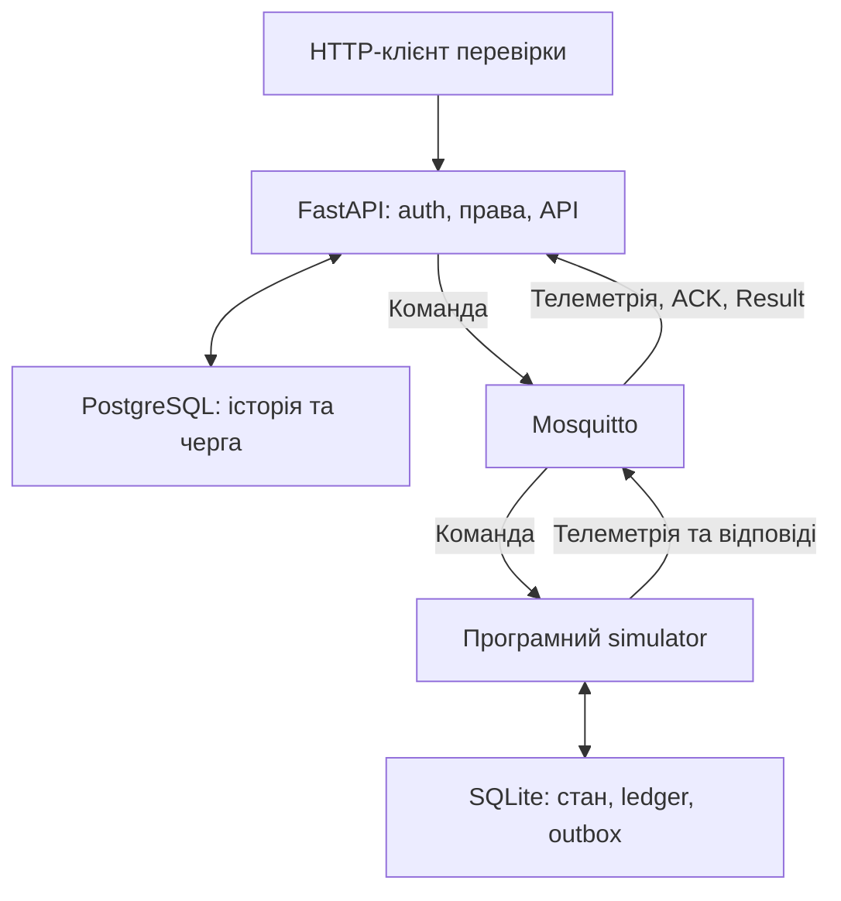

# Досьє V3.5 — Етап 8

## Підготовка тестової версії backend — загальне підсумкове досьє

**Статус етапу:** завершено, прийнято 6 із 6 операцій.  
**Дата реалізації та завершення приймання:** 26.09.2026.  
**Дата укладання досьє:** 26.09.2026.  
**Вхідна версія:** backend `0.31.0`, міграція `20260925_0015`.  
**Підсумкова версія:** backend `0.37.0`, міграція `20260926_0017`.  
**Репозиторій:** `Mahone1008/STechbaza-iot`, гілка `main`.  
**Підсумок:** перша тестова версія backend прийнята для подальшої розробки фронтенду.

Досьє об'єднує мету, шість операцій, архітектурні рішення, зміни коду й БД,
перевірки, виправлення та межі готовності. Джерела — код і документація на
[f12c624](https://github.com/Mahone1008/STechbaza-iot/commit/f12c624792471f852ca613313dd0b7f541df3640),
[журнал Етапу 8](stage-8-test-backend.md), зафіксовані CI та локальні приймання.
Код фінального повного CI — `38d231a`; користувач перевірив main на `ae0aada`;
`f12c624` зафіксував закриття етапу в документації.

Це підсумок визначеного етапу, а не нова функціональна операція.
Фронтенд у межах Етапу 8 не створювався; його початок відкладено за
вказівкою користувача до завершення документування.

## Зміст

1. [Мета та результат для продукту](#1-мета-та-результат-для-продукту)
2. [Початкова точка і збережений фундамент](#2-початкова-точка-і-збережений-фундамент)
3. [Терміни](#3-терміни)
4. [Карта операцій, версій і тестів](#4-карта-операцій-версій-і-тестів)
5. [Архітектура тестового стенду](#5-архітектура-тестового-стенду)
6. [Модульний принцип та джерела даних для UI](#6-модульний-принцип-та-джерела-даних-для-ui)
7. [Операція 1 — API для перших екранів](#7-операція-1--api-для-перших-екранів)
8. [Операція 2 — авторизація в браузері](#8-операція-2--авторизація-в-браузері)
9. [Операція 3 — дані панелі та графіків](#9-операція-3--дані-панелі-та-графіків)
10. [Операція 4 — постійний демонстраційний стенд](#10-операція-4--постійний-демонстраційний-стенд)
11. [Операція 5 — комплексні перевірки та відновлення](#11-операція-5--комплексні-перевірки-та-відновлення)
12. [Операція 6 — чиста установка, backup/restore і тестова збірка](#12-операція-6--чиста-установка-backuprestore-і-тестова-збірка)
13. [База даних і міграції](#13-база-даних-і-міграції)
14. [Права, браузерні сесії та межі команд](#14-права-браузерні-сесії-та-межі-команд)
15. [Автоматичні перевірки та CI](#15-автоматичні-перевірки-та-ci)
16. [Локальне приймання й докази](#16-локальне-приймання-й-докази)
17. [Виявлені перешкоди та виправлення](#17-виявлені-перешкоди-та-виправлення)
18. [Карта коду й документів](#18-карта-коду-й-документів)
19. [Стан локального середовища та повторення перевірок](#19-стан-локального-середовища-та-повторення-перевірок)
20. [Що готово і що залишається](#20-що-готово-і-що-залишається)
21. [Критерії завершення етапу](#21-критерії-завершення-етапу)
22. [Точка продовження та порядок роботи](#22-точка-продовження-та-порядок-роботи)
23. [Пов'язані документи й контрольні посилання](#23-повязані-документи-й-контрольні-посилання)

## 1. Мета та результат для продукту

Після Етапу 7 сервер уже приймав телеметрію, виконував протокол команд,
обмежував доступ і вів аварії та повідомлення. Етап 8 підготував цей
фундамент до першого користувацького інтерфейсу: визначив його API,
браузерний вхід, якість показань, графіки, постійний demo та відтворюване
приймання зі встановленням і відновленням даних.

| Потреба | Підсумковий результат |
|---|---|
| Будувати екрани без припущень про права | API актуальних permissions і device overview |
| Показувати лише встановлені модулі | Enabled capabilities, підтримувані показники й дозволені команди |
| Входити з браузера та завершувати доступ | Cookie refresh, короткий access, rotation/logout, CSRF/CORS і rate limits |
| Відрізняти нуль, відсутність і старі дані | `readings` та `telemetry_freshness` з явними станами |
| Малювати графік за період | Обмежені часові вибірки з агрегатами й пропусками |
| Розробляти без постійного підключення VFD | Дві організації, різні ролі, шість demo-пристроїв і MQTT simulator |
| Перевірити відмови між компонентами | Реальні restart simulator/backend, stop/start broker, черга і TTL |
| Відтворити запуск та відновити копію | Чиста збірка, порожня БД, backup, точне порівняння restore та recovery policy |
| Мати перевірену точку продовження | `0.37.0`, 109 regression tests без пропусків, CI та локальне приймання |

Готовність означає можливість підключати й тестувати frontend на
ізольованому програмному стенді. Комерційна експлуатація, фізичні захисти,
публічне розгортання та масштаб 10 000 контролерів мають окремі критерії.

## 2. Початкова точка і збережений фундамент

Вхід — завершений [Етап 7](dossier-v3.5-stage-7-events-alarms-core.md).
До Етапу 8 вже існували:

- ієрархія Organization → Site → Device, каталог і призначення capabilities;
- PostgreSQL, Alembic, FastAPI, SQLAlchemy та Mosquitto;
- MQTT telemetry/heartbeat, історія, snapshot, sequence і device sessions;
- durable commands, request ID, TTL, retry, ACK/Result та actor audit;
- користувачі, server-side auth sessions, memberships, tenant RBAC;
- events, alarms, transitions, числові правила, acknowledge;
- атомарні in-app notifications та особисті позначки прочитання;
- 28 автоматичних тестів після завершення Етапу 7.

Етап 8 розширює чинні моделі та policies. Він не замінює їх окремою
demo-логікою доступу: нові показання й відповіді симулятора проходять
звичайний MQTT ingestion, а demo-входи використовують звичайну авторизацію.

## 3. Терміни

| Термін | Практичне значення |
|---|---|
| API-контракт | Запити, відповіді, права, обмеження та помилки, на які спирається UI |
| DTO / read model | Відповідь для екрана, складена з чинних даних без зміни їхньої історії |
| Capability | Можливість конкретного пристрою, наприклад `pressure.read` |
| Permission | Право користувача, наприклад `command.execute` |
| Tenant | Організація-клієнт із власною областю доступу |
| Access / refresh | Короткий токен API та secret для його оновлення |
| Rotation | Заміна refresh: старе значення стає недійсним |
| Freshness | Оцінка давності пакета; не тотожна online пристрою |
| Bucket | Часовий інтервал графіка з агрегатами й лічильниками якості |
| Seed | Контрольоване створення початкових demo-даних |
| Ledger / outbox | Збережений журнал команд / відповіді, які треба доставити |
| Regression test | Перевірка, що вже визначена поведінка не зламалася після змін |
| CI | Автоматичні перевірки GitHub Actions в окремому середовищі |
| Fault/recovery | Навмисна відмова компонента та перевірка його відновлення |
| Fingerprint | Кількість, контрольні суми даних та опис структури для порівняння копій |
| Canary | Контрольний login або команда для перевірки конкретного ризику restore |
| Recovery policy | Явні зміни відновленої копії перед дозволом роботи її workers |

## 4. Карта операцій, версій і тестів

Кожна операція окремо реалізована, перевірена в CI та прийнята користувачем.
Усі шість закрито 26.09.2026.

| № | Операція | Backend | Міграція після операції | Додано тестів | Усього |
|---|---|---|---|---|---|
| 1 | API для перших екранів | `0.32.0` | `20260925_0015` | 10 | 38 |
| 2 | Авторизація в браузері | `0.33.0` | `20260926_0016` | 16 | 54 |
| 3 | Дані панелі та графіків | `0.34.0` | `20260926_0017` | 20 | 74 |
| 4 | Постійний демонстраційний стенд | `0.35.0` | `20260926_0017` | 12 | 86 |
| 5 | Комплексні перевірки й відновлення | `0.36.0` | `20260926_0017` | 12 | 98 |
| 6 | Чиста установка, backup/restore, приймання збірки | `0.37.0` | `20260926_0017` | 11 | 109 |

Числа стосуються unittest suite. Реальний Chromium і багатофазні live
Compose-сценарії виконуються додатково та не додаються до числа 109.
Зростання 28 → 109 означає 81 нову regression-перевірку за весь Етап 8.

## 5. Архітектура тестового стенду



Simulator не має доступу до PostgreSQL. Новий UI використовуватиме HTTP
API; браузер не повинен напряму звертатися до БД або MQTT broker.

| Середовище | Призначення | Ізоляція |
|---|---|---|
| Основний `compose.yml`, порт 8000 | Попередній локальний стек | Окремий від demo |
| `compose.demo.yml`, project `techbaza-demo`, порт 8001 | Постійна сцена для frontend і приймання | Власні БД, broker, simulator і volumes |
| `compose.acceptance.yml`, унікальний `*-clean` | Збірка з tracked source та порожня БД | Власні мережа/volumes, без host ports |
| `compose.acceptance.yml`, унікальний `*-restore` | Відновлення backup і перевірка копії | Власні мережа/volumes, без host ports |
| GitHub Actions | Автоматичне приймання | Тимчасове CI-оточення |

Demo API прив'язаний до `127.0.0.1:8001`. PostgreSQL і MQTT цього стенду
не публікують порти на host. Тестовий MQTT anonymous доступ обмежений
Docker-мережею; це не готова конфігурація зовнішнього сервера.

## 6. Модульний принцип та джерела даних для UI

TechBaza залишається конструктором. Наявність тиску, рівня води чи VFD
не припускається для кожного клієнта. Склад віджетів визначає API
конкретного пристрою, а можливість дії — додатково permissions користувача.

| Питання екрана | Джерело |
|---|---|
| Які клієнти й об'єкти доступні? | Списки organizations/sites/devices з tenant guards |
| Які права є зараз? | `/organizations/{id}/access` |
| Які модулі й команди має пристрій? | `overview.capabilities`, `command_types`, `allowed_commands` |
| Чи є зв'язок? | `overview.availability` |
| Які показання та наскільки вони старі? | `snapshot`, `telemetry_freshness`, `readings` |
| Що було за період? | `/devices/{id}/telemetry/series` |
| Чи виконана команда? | Збережений command status та Result |
| Яка проблема активна і хто її побачив? | Alarms і transitions |
| Що прочитав саме цей користувач? | Notifications та персональний read receipt |

Пристрій тільки з `pressure.read` не отримує кнопки VFD. Viewer бачить
дозволені показання, але не може виконувати commands. Вимкнення capability
прибирає її показники з overview та закриває графік, не видаляючи історію.
Backend повторно перевіряє доступ на кожному запиті.

## 7. Операція 1 — API для перших екранів

**Проблема:** майбутньому frontend потрібен узгоджений спосіб отримати
актуальні права, модулі та стан пристрою без дублювання серверних правил.

Додано:

- `GET /api/v1/organizations/{organization_id}/access`;
- `GET /api/v1/devices/{device_id}/overview`;
- схеми відповідей, OpenAPI, validation та access errors;
- стабільне сортування базових списків: час створення плюс UUID;
- 10 тестів HTTP/JWT, модульності, доступу, empty/offline та контракту.

Access повертає platform/organization role і відсортовані permissions.
Overview об'єднує реквізити пристрою, права, availability, enabled
capabilities, підтримувані keys, commands і nullable snapshot.
Довільний capability code не породжує автоматично нову підтримувану metric.

Списки залишаються JSON-масивами з limit/offset. Порожній список — `[]`.
Додатковий UUID усуває невизначений порядок однакових timestamps, але
не перетворює offset pagination на cursor pagination.

**Приймання:** 38 тестів без пропусків, нові маршрути в OpenAPI,
працюючий backend `0.32.0`. Повний контракт:
[Frontend API contract v1](frontend-api-contract-v1.md).

## 8. Операція 2 — авторизація в браузері

**Проблема:** браузеру потрібні відновлення входу після reload, контрольоване
оновлення сесії та logout без зберігання refresh у доступному JavaScript сховищі.

Додано browser login/refresh/logout через `/api/v1/auth/browser/*`:

- access JWT повертається в JSON; frontend має тримати його лише в пам'яті;
- refresh передається в `HttpOnly`, `SameSite=Strict` cookie з обмеженим Path;
- browser JSON не містить refresh secret; у БД зберігається його hash;
- rotation робить старий refresh недійсним, logout відкликає server-side session;
- перевіряються exact Origin і `X-TechBaza-CSRF: 1`, використовується CORS allowlist;
- auth responses мають no-store, validation не відображає введені secrets;
- старий JSON flow збережено для CLI та попередніх інструментів.

Типові строки: access — 15 хвилин, абсолютне життя session — 30 днів.
Refresh не подовжує абсолютну межу. Після revoke навіть ще не прострочений
access відхиляється. Два одночасні refresh не мають обидва успішно
використати один secret; майбутній UI повинен координувати вкладки.

Ліміти входу зберігаються у PostgreSQL, спільні для legacy/browser flows
та переживають restart. Ключі HMAC не містять відкритий email/IP.
Типове вікно — 300 секунд: login 30 на IP і 10 на account, session routes
120 на IP. Перевищення — 429 з Retry-After; недоступне сховище — 503.

Міграція `0016` додає `auth_rate_limits`. Додано 16 unittest tests;
окремо CI запускає справжній Chromium для cookie, reload/rotation,
CSRF/CORS, logout і access revocation.

**Приймання:** 54 тести без пропусків; CI Chromium — PASS; локально
CORS preflight 200, refresh без Origin/header 403, health `0.33.0`.
[Повний контракт і межі](browser-auth-v1.md).

## 9. Операція 3 — дані панелі та графіків

**Проблема:** online не доводить свіжість показань; пропуск не можна
показувати нулем, а необмежений графік може перевантажити БД.

Overview доповнено `telemetry_freshness` і `readings`.

| Стан показника | Значення для UI |
|---|---|
| `missing` | Показника немає або він null; показати відсутність даних |
| `invalid` | Значення не є підтримуваним скінченним числом; value null |
| `fresh` | Показати число та одиницю, пакет пройшов перевірку давності |
| `stale` | Зберегти число, але явно позначити його давність |

Нуль залишається числом; boolean не перетворюється на число. Новий
heartbeat не омолоджує старий snapshot. Перевіряються відсутність пакета,
device session, майбутній timestamp, давність приймання та reported time.
Типовий freshness threshold — 120 секунд; demo використовує 20.

Новий маршрут: `GET /api/v1/devices/{device_id}/telemetry/series`.

| Властивість | Контракт |
|---|---|
| Метрики | `vfd.frequency_hz`, `vfd.current_a`, `pressure.bar`, `water_level.percent` за capabilities |
| Часова вісь | `server_received_at`, UTC, `[start, end)` |
| Період | Не більше 7 днів |
| Інтервали | Не більше 1000; bucket 1–86400 секунд, типово 300 |
| Вхідний обсяг | Не більше 100000 пакетів пристрою за період |
| SQL | Timeout 3 секунди; явна відмова при перевищенні |
| Агрегати | Minimum, maximum, average валідних samples та counts |
| Якість bucket | `ok`, `partial`, `missing`, `invalid`, `empty` |
| Пропуски | Null агрегати, без інтерполяції чи перенесення попереднього значення |

Average — середнє samples, а не середнє за тривалістю. Унікальні пізні
пакети можуть бути в історії, не повертаючи поточний snapshot назад.
Час приймання не видається за гарантований час фізичного вимірювання.

Міграція `0017` розширює індекс telemetry до `(device_id, received_at, id)`.
Додано 20 тестів: 7 unit та 13 PostgreSQL.
**Приймання:** 74 тести без пропусків, OpenAPI, 401 без JWT, health `0.34.0`.
[Контракт графіків і якості](telemetry-panel-charts-v1.md).

## 10. Операція 4 — постійний демонстраційний стенд

**Проблема:** короткі fixtures недостатні для щоденної розробки екранів.
Потрібні стабільні identities, історія та різні стани пристроїв.

Створено окремий `techbaza-demo`. Seed має opt-in, перевірку назви БД,
атомарну ініціалізацію та advisory lock. UUID стабільні. Повторний seed
зберігає дані, паролі, ролі, конфігурацію й історію; невідповідність
credentials завершується помилкою замість автоматичного reset.

### 10.1. Користувачі та модулі

Усі чотири demo accounts мають `platform_role=user`:

| Account | Організація | Membership |
|---|---|---|
| `owner@techbaza-demo.example.com` | A | owner |
| `operator@techbaza-demo.example.com` | A | operator |
| `viewer@techbaza-demo.example.com` | A | viewer |
| `other@techbaza-demo.example.com` | B | owner |

Паролі генеруються випадково й зберігаються локально в `.env.demo`;
до досьє вони не входять. Глобального superadmin у demo seed немає.

| Пристрій | Призначення |
|---|---|
| `TB-DEMO-PUMP` | VFD control, frequency/current/state, pressure; Start/Stop/Set Frequency |
| `TB-DEMO-PRESSURE` | Тільки тиск: normal, low alarm, gap, offline |
| `TB-DEMO-STALE` | Heartbeat є, показання старі |
| `TB-DEMO-OFFLINE` | Старі показання, нового зв'язку немає |
| `TB-DEMO-NEW` | Модуль рівня води, телеметрії ще немає, snapshot null |
| `TB-DEMO-OTHER` | Живий тиск іншої організації B |

Два початкові старі snapshot і два історичні пакети створює seed як
явні fixtures. Нові live readings, ACK і Result надходять через MQTT.
Тривала історія графіків накопичується під час роботи.

### 10.2. Збереження стану симулятора

Віртуальна зміна running/frequency, command ledger та відповіді
записуються в одну SQLite-транзакцію перед publish. Outbox повторює
недоставлені відповіді. Той самий command ID повертає попередній результат
без повторної зміни стану; конфлікт envelope відхиляється.

Нову прострочену команду simulator не виконує. Уже збережений результат
можна повторно доставити. Restart зберігає стан і ledger, але створює
нову boot session; sequence починається заново. File lock обмежує запуск
двох runner-процесів на одному volume, callback використовує обмежену чергу.

### 10.3. Наскрізні сценарії

Перевірено чотири входи, tenant isolation, viewer 403, різні modules/states,
HTTP command → MQTT → ACK/Result → API, deduplication та actor audit.
Також перевірено графік, low-pressure alarm, acknowledge, особисте read_at,
recovery, gap, VFD fault і Stop, а потім справжній restart simulator.

У fault-сценарії Start/Set Frequency повертають `failed`, Stop доступний.
Це поведінка програмного стенду, не доказ реалізації фізичного аварійного Stop.

**Приймання:** 86 тестів без пропусків, усі live/restart PASS,
health `0.35.0`; demo залишено працювати на 8001.
[Склад і робота стенду](demo-stand-v1.md).

## 11. Операція 5 — комплексні перевірки та відновлення

**Проблема:** успішні окремі endpoints не доводять узгодженість системи
при одночасних запитах, відкликанні доступу або відмові процесу.

### 11.1. Нові 12 regression-сценаріїв

| Група | Що перевірено |
|---|---|
| Конкурентні commands | Два однакові request ID: 201/200, один запис, один publish, один actor |
| Конфлікти idempotency | Інший payload/user/device з тим самим request ID: 409 без зміни оригіналу |
| Membership через HTTP | Зниження ролі й revoke діють для вже виданого JWT на наступних запитах |
| Capability через HTTP | Вимкнення прибирає дію з overview і блокує новий POST; audit збережено |
| Validation | Невалідні UUID/TTL/type/payload/frequency не створюють command/publish |
| Tenant і sessions | Anonymous/foreign/revoked не читають і не змінюють захищені ресурси |
| Delivery | Невдалий publish залишає durable queue; наступна session повторює той самий envelope |
| TTL | Offline expiry без publish і без дубльованої alarm/notification |
| ACK/Result | Result до ACK, дублікати, конфлікт Result та неправильний Device UID |
| Телеметрія | Duplicate/sequence/old session не повертають snapshot і alarm назад |

Матриця групує 12 тестів; повний перелік наведено в
[Comprehensive checks v1](comprehensive-checks-v1.md).
Частина delivery-тестів підміняє publish для перевірки окремих переходів.
Вони доповнюються справжніми HTTP/MQTT/Compose-сценаріями.

### 11.2. Фактичні відмови контейнерів

1. Simulator переводиться в offline: з'являються offline/stale та одна
   active alarm; дві frequency commands лишаються queued з TTL 300 і 5 секунд.
2. Docker перезапускає backend. IDs, `created_at`, `expires_at` і черга
   зберігаються. Коротка команда стає expired без publish, довга виконується
   після повернення simulator. Повтор HTTP не створює нову команду.
3. Docker зупиняє broker. HTTP працює, але API показує offline/stale,
   аварію та queued command замість удаваного успіху.
4. Broker запускається: відновлюються telemetry/commands, incident
   завершується один раз, перевіряються Start/показання/Stop.

Повторно проходять live-сценарії операції 4 і restart simulator.
`/health` є liveness: його `ok` під час outage не доводить доступність MQTT.

Додано строгий `app.tools.backend_check`: обидва DB/MQTT opt-in flags
обов'язкові, failure/error, порожній набір або хоча б один skip дають
ненульовий exit code. Частковий unittest `OK (skipped=...)` не є прийманням.

**Приймання:** 98 тестів без пропусків, simulator/backend/broker recovery —
PASS, health `0.36.0`; нової міграції немає.

## 12. Операція 6 — чиста установка, backup/restore і тестова збірка

**Проблема:** працездатний старий контейнер не доводить, що commit можна
встановити заново, а файл dump не доводить можливість відновити систему.
Окремий ризик — повернення старих sessions і повторне виконання команд із backup.

### 12.1. Чиста установка

`git archive HEAD` експортує tracked source. Image збирається без cache;
новий ізольований project отримує порожні volumes. Перевіряються:

- порожня цільова БД та весь ланцюжок міграцій до `0017`;
- 109 regression tests із нульовою кількістю skips;
- seed і повний live HTTP/MQTT сценарій;
- видалення лише тимчасового clean project після успіху.

Перевірений image використовується для звичайного demo. Його seed
перевіряє існуючі identities/credentials, зберігаючи накопичені дані.
Це доводить встановлення tracked commit; бітову відтворюваність образу
не заявлено, оскільки production pinning залежностей ще потребує роботи.

### 12.2. Узгоджена резервна копія

Backend і simulator джерела короткочасно зупиняються. За відсутності
сторонніх writers створюються fingerprint PostgreSQL, SQLite backup
із committed WAL та PostgreSQL custom dump. Джерело відновлює роботу
до перевірки відновленого стенду.

| Частина bundle | Що зберігає |
|---|---|
| `postgres.dump` | Схему й дані demo БД |
| `simulator.sqlite3` | Device state, command ledger і pending replies |
| `environment.env` | Існуючі credentials і JWT secret |
| `source.tar` | Tracked source перевіреного commit |
| `source.json` | Кількості/хеші рядків і fingerprint схеми |
| `manifest.json` | Версії, Git SHA, розміри й SHA-256 п'яти файлів |
| Звіти restore та `acceptance-report.json` | Порівняння, recovery guard, HTTP canaries і підсумок |

Dump копіюється бінарно через `docker compose cp`, без текстового
PowerShell перенаправлення. SHA-256 виявляє пошкодження файлів, але
не є шифруванням чи цифровим підписом.

### 12.3. Точність відновлення

Створюється новий restore project без host ports. Цільова БД повинна бути
порожньою; `pg_restore` працює однією транзакцією з відмовою при помилці,
без `--clean`. SQLite import не перезаписує існуючий файл.

**До recovery policy і запуску workers** порівнюються схема та всі рядки
20 public tables. Перевірка охоплює columns/types/defaults/nullability,
constraints та indexes поточної схеми. Окремо звіряються всі рядки SQLite
devices/commands, включно зі станом та відповідями.

Fingerprint не є універсальним аудитом довільної PostgreSQL інсталяції:
cluster roles/ACL, extensions, functions, views та sequences не входять
до заявленого обсягу. Поточні моделі мають UUID keys.
Старий MQTT broker volume не відновлюється; ціль має порожній broker.

### 12.4. Recovery policy перед запуском

| Стан із backup | Дія |
|---|---|
| Невідкликані auth sessions | Відкликати; для доступу потрібен новий login |
| `queued` / `published` commands | `expired`, причина `restore_delivery_cancelled`; заборонити доставку |
| `acknowledged` commands | `result_unknown`, причина `restore_result_unknown`; не виконувати повторно |
| `succeeded` / `failed` / `expired` / `result_unknown` | Зберегти історичний результат |
| Старі auth rate-limit windows | Очистити на ізольованій цілі; нові входи використовують штатний limiter |

Sessions, commands та відповідні alarms/notifications змінюються однією
транзакцією. Помилка відкочує все; повтор policy не створює дублікати.
Звичайний HTTP startup ці дії не виконує: потрібен явний acceptance CLI
з demo/acceptance opt-in і перевіркою цільової БД.

`expired` після restore означає заборону доставки з копії. Цей статус
не доводить, що фізична дія не відбулася раніше. Для реального обладнання
потрібні окремі звірення стану й процедура відновлення керування.

### 12.5. Live-підтвердження

Контрольні old access/refresh фактично отримують HTTP 401, новий login
працює. Контрольна queued STOP лишається expired з нульовими publish
attempts; повтор request ID не оживляє її. Перевірка повторюється після
повного live HTTP/MQTT сценарію на відновленій копії.

Нові boot sessions simulator зберігають попередній state/ledger.
Звичайний demo також проходить quick HTTP та health `0.37.0`.
Після завершення видаляються лише тимчасові clean/restore projects і volumes.

**Приймання:** 109 тестів без пропусків; clean install, усі 20 таблиць,
SQLite, recovery guard, live source/restore і фінальний звіт — PASS.
[Повна процедура та межі](backup-restore-v1.md).

## 13. База даних і міграції

Етап додає дві міграції. Операції 4–6 не потребують зміни схеми.

| Revision | Зміна | Наслідок |
|---|---|---|
| `20260926_0016` | Нова `auth_rate_limits`, індекс `expires_at` | Спільне збереження auth-лімітів між процесами |
| `20260926_0017` | Індекс telemetry `(device_id, received_at, id)` | Стабільні часові вибірки та tie-break за UUID |

У фінальному restore порівняно 19 таблиць застосунку та `alembic_version`:

| Група | Таблиці |
|---|---|
| Клієнти й обладнання | `organizations`, `sites`, `devices`, `capabilities`, `device_capabilities` |
| Доступ | `users`, `organization_memberships`, `auth_sessions`, `auth_rate_limits` |
| Телеметрія | `telemetry_messages`, `device_states`, `device_sessions` |
| Команди | `device_commands` |
| Події й аварії | `device_events`, `device_alarms`, `alarm_transitions`, `device_alarm_rule_states` |
| Повідомлення | `alarm_notifications`, `notification_reads` |
| Версія схеми | `alembic_version` |

CI перевірив створення порожньої БД, downgrade до `0016`, `0015`, `0014`
та повторний upgrade до head. Це випробування тимчасової CI-бази;
відкат заповненої клієнтської БД не можна прирівнювати до нього.
Для фінального demo окремо підтверджено logical backup/restore зі збереженням даних.

## 14. Права, браузерні сесії та межі команд

1. Frontend використовує permissions/capabilities API, а backend перевіряє
   право знову при виконанні запиту. Прихована кнопка не є захистом.
2. Access зберігається в пам'яті; refresh — в HttpOnly cookie.
   LocalStorage/sessionStorage для цих токенів не використовуються.
3. Login/refresh/logout потребують серіалізації між запитами й вкладками.
   Після 401 дозволений один координований refresh і обмежений повтор;
   403 не повинен запускати нескінченне оновлення токена.
4. Зміна membership або capability блокує наступні недозволені HTTP дії.
   Уже прийнята durable command має власний TTL; cancel-протокол цим
   етапом не додано. Зміна ролі не обіцяє скасування старої команди.
5. HTTP 201 та ACK не означають фізичного виконання. `result_unknown`
   залишається невизначеним і не є підставою автоматично повторити Start.
6. Повтор одного наміру використовує той самий request ID і payload.
   Новий request ID означає новий намір, а не технічний retry.
7. Alarm acknowledge, resolve і notification read — різні дії.
8. HttpOnly не усуває XSS. Безпека майбутнього UI має власні перевірки.

Локальний HTTP використовує cookie Secure=false лише для loopback.
Публічне середовище потребує HTTPS, Secure=true, власних secrets і
узгодженого same-site розміщення. За reverse proxy окремо налаштовуються
довірені proxy addresses; поточний `--no-proxy-headers` не довіряє
довільному X-Forwarded-For.

## 15. Автоматичні перевірки та CI

### 15.1. Рівні доказів

| Рівень | Що підтверджує | Межа |
|---|---|---|
| Unit | Валідація, policies, агрегати, SQLite/bundle helpers | Не доводить роботу реального PostgreSQL/MQTT |
| PostgreSQL/HTTP/JWT | Транзакції, locks, constraints, права, concurrency | Частина HTTP виконується через ASGI test client |
| MQTT integration | Доставка, повтор після помилки обробки | Не є фізичним контролером |
| Chromium | Справжні cookie, CORS/CSRF, reload, logout | Перевіряє auth flow, не завершений frontend |
| Docker live demo | Реальний HTTP/MQTT, simulator, перезапуски та outage | Програмна модель обладнання |
| Clean/restore acceptance | Встановлення commit, копія даних, recovery policy, live restore | Локальний logical backup demo |
| Користувацьке приймання | Відтворення погодженого сценарію на Windows | Окрема підтверджена машина, не production пілот |

Часткові прогони середовища розробки зі skipped DB/MQTT tests збережені
в журналі. Їх не прирівняно до повного CI чи локального приймання.
Поточний строгий runner вимагає нуль skips.

### 15.2. Успішні контрольні CI-прогони

| Операція | Код | GitHub Actions | Hardening suite, без skips |
|---|---|---|---|
| 1 | `030f033` | [36262474597](https://github.com/Mahone1008/STechbaza-iot/actions/runs/36262474597) | 38 tests, 4.750 s |
| 2 | `2ca71a1` | [36263951374](https://github.com/Mahone1008/STechbaza-iot/actions/runs/36263951374) | 54 tests, 5.045 s |
| 3 | `e96793b` | [36264996670](https://github.com/Mahone1008/STechbaza-iot/actions/runs/36264996670) | 74 tests, 6.591 s |
| 4 | `047feaf` | [36265982282](https://github.com/Mahone1008/STechbaza-iot/actions/runs/36265982282) | 86 tests, 6.411 s |
| 5 | `9b84fa2` | [36267006983](https://github.com/Mahone1008/STechbaza-iot/actions/runs/36267006983) | 98 tests, 7.657 s |
| 6 | `38d231a` | [36269123220](https://github.com/Mahone1008/STechbaza-iot/actions/runs/36269123220) | 109 tests, 8.438 s |

У фінальному run використано Python 3.13, PostgreSQL 16 і Mosquitto 2.
Hardening job `108479575336` підтвердив suite, міграції та Chromium.
Demo job `108479774508` додатково підтвердив:

- 109 tests за 7.864 s у Docker demo;
- попередні live, simulator/backend restart і broker outage/recovery;
- 109 tests за 8.044 s на чистій установці;
- точне порівняння 20 таблиць та SQLite, sessions/commands recovery guard;
- повторні canaries, live restore, health, report і cleanup.

Це три прогони того самого набору в різних умовах, а не 327 різних тестів.
У журналі зафіксовано перевірку логів jobs, а не тільки зелених статусів.
Поточне досьє є документаційною зміною; нового повного backend-прогону
для його укладання не виконували.

## 16. Локальне приймання й докази

### 16.1. Шість послідовних приймань

| Операція | Main, перевірений користувачем | Результат suite | Health | Скриншотів успішного приймання |
|---|---|---|---|---|
| 1 | `457a989` | 38 tests, 7.039 s, OK | `0.32.0` | 3 |
| 2 | `98c8b06` | 54 tests, 5.349 s, OK | `0.33.0` | 4 |
| 3 | `0d6928d` | 74 tests, 6.705 s, OK | `0.34.0` | 4 |
| 4 | `afb637f` | 86 tests, 6.997 s, OK | `0.35.0` | 7 |
| 5 | `2f3c45a` | 98 tests, 7.630 s, OK | `0.36.0` | 6 |
| 6 | `ae0aada` | 109 tests, 7.454 s, OK | `0.37.0` | 11 |

У всіх наведених прийманнях — нуль пропусків. Разом у журналі описано
35 скриншотів успішних приймань; попередні невдалі спроби не зараховані.
Для кожного файла наведено його ім'я і підтверджений результат у
[хронологічному журналі](stage-8-test-backend.md).
Це досьє посилається на реєстр доказів; самі зображення до цього Markdown
не вбудовані.

### 16.2. Фінальна операція 6: прив'язка до скриншотів

Усі імена нижче мають формат `image(20260926-<час>).png`.

| Час у назві | Підтверджений крок |
|---|---|
| `203917` | Правильний origin, fast-forward main до ae0aada, збірка |
| `203933` | Новий clean project, порожня БД, міграції до 0017 head |
| `203946` | Browser/comprehensive/demo/frontend/hardening regression tests |
| `203959` | MQTT redelivery ok, restore/precision/CHECK tests, 109 tests за 7.454 s |
| `204009` | OK, zero skips, seed нової demo-бази |
| `204432` | Live clean PASS, clean cleanup, оновлення звичайного demo без скидання даних |
| `204443` | Існуючі identities, ролі та модулі збережено |
| `204455` | Live source PASS, canaries, 20-table snapshot, SQLite/dump, SHA-256, нова restore-ціль |
| `204507` | Схема й усі 20 таблиць збігаються; міграція та credentials перевірені |
| `204526` | SQLite/boot/state/ledger, recovery guard, старі tokens/STOP та live restore — PASS |
| `204536` | Health 0.37.0, report, cleanup, працюючий source demo, фінальний PASS |

Підсумковий рядок:

```text
PASS: Stage 8 operation 6 - clean install, exact backup/restore, safe recovery, demo 0.37.0
```

Приватна копія і звіт залишені у користувача:
`backups/acceptance-20260926-233445-7e358328/`.
Створення `acceptance-report.json` підтверджене console report routine;
вміст приватного bundle не передавався і незалежно не перечитувався.
У Git не додаються dump, environment або canary secrets.

## 17. Виявлені перешкоди та виправлення

### 17.1. Локальний запуск операції 1

Перший блок був виконаний поза папкою репозиторію: Git повідомив
`not a git repository`, Compose — відсутність configuration file.
Інструкцію виправлено явним `Set-Location`, перевіркою шляху та одним
PowerShell script block із зупинкою після помилки.

Наступна спроба зупинилася через недоступний Docker Linux engine.
Після запуску Docker Desktop користувач пройшов повний сценарій.
Ці спроби не зараховувалися як успішні тести або приймання.

### 17.2. Відновлення БД: точність і еквівалентність схеми

Три початкові CI-прогони операції 6 не пройшли restore comparison:

| Run | Код | Статус |
|---|---|---|
| [36268246247](https://github.com/Mahone1008/STechbaza-iot/actions/runs/36268246247) | `3f61b79` | Не зараховано |
| [36268559498](https://github.com/Mahone1008/STechbaza-iot/actions/runs/36268559498) | `f87e216` | Не зараховано |
| [36268669333](https://github.com/Mahone1008/STechbaza-iot/actions/runs/36268669333) | `08d949f` | Не зараховано; розширена діагностика |

Діагностика підтвердила збіг кількості та вмісту всіх 20 таблиць.
Відмінність стосувалася SQL-запису CHECK у семи таблицях: після
pg_dump/restore PostgreSQL переносив cast varchar array → text array
на окремі елементи. Семантика обмеження залишалася тією самою.

Виправлено нормалізацію саме цієї еквівалентної форми. Constraints,
дозволені значення та оператори не виключалися з порівняння. Regression
перевіряє успішний round-trip, а також виявлення справжньої зміни CHECK
і зміни timezone у типі timestamp.

Окремо усунено втрату точності fingerprint через Python float.
Рядки хешуються з PostgreSQL JSON text без такого перетворення.
PostgreSQL test розрізняє близькі numeric/JSONB значення за межами
точності float. Початкові 107 tests розширено до підсумкових 109.

Після виправлень код `38d231a` пройшов весь CI, а користувач — локальний
сценарій. Причини невдач збережені, порівняння не вимкнено заради PASS.

### 17.3. Очікувані повідомлення тестів

| Повідомлення | Пояснення |
|---|---|
| `Injected temporary database processing failure` | Навмисна тимчасова відмова ingestion для перевірки MQTT redelivery |
| `MQTT message processing must be retried` | Продовження того самого fault-сценарію; успіх підтверджує подальший `ok` |
| Duplicate-key у конкурентному тесті | Constraint відхиляє другий INSERT; перевіряються 201/200, один record/publish |
| `Stage 8 operation 4 ... live demo acceptance complete` в пізніших операціях | Повторне виконання попередніх live-сценаріїв як регресії |

Наявність такого тексту сама по собі не доводить успіх. Потрібні
очікувана кінцева поведінка, відсутність failures/skips і фінальний PASS.

## 18. Карта коду й документів

| Відповідальність | Основні файли |
|---|---|
| Access/overview/series routes | `backend/app/api/v1/frontend.py` |
| Read models | `backend/app/schemas/frontend.py`, `telemetry_read.py` |
| Overview service | `backend/app/services/frontend.py` |
| Browser endpoints | `backend/app/api/v1/auth.py`, `backend/app/schemas/auth.py` |
| Cookie/Origin/config | `backend/app/security/browser_auth.py`, `browser_config.py` |
| Auth limiter | `backend/app/services/auth_throttle.py`, `backend/app/repositories/auth_rate_limits.py`, `backend/app/models/auth_rate_limit.py` |
| Якість показань | `backend/app/services/telemetry_quality.py`, `telemetry_read_config.py` |
| Графіки | `backend/app/services/telemetry_series.py`, `backend/app/repositories/telemetry_series.py` |
| Каталог, secrets, seed demo | `backend/app/demo/catalog.py`, `config.py`, `seed.py` |
| Simulator та SQLite | `backend/app/demo/simulator.py`, `state.py` |
| Live HTTP/MQTT | `backend/app/demo/check.py` |
| Restart/outage checks | `backend/app/demo/resilience.py` |
| Bundle/fingerprint/SQLite helpers | `backend/app/operations/backup.py` |
| Recovery policy | `backend/app/operations/recovery.py` |
| Acceptance CLI та canaries | `backend/app/demo/backup_check.py` |
| Строгий suite / Chromium | `backend/app/tools/backend_check.py`, `browser_auth_check.py` |
| Міграції | `backend/alembic/versions/20260926_0016_auth_rate_limits.py`, `20260926_0017_telemetry_read_index.py` |
| Docker середовища | `compose.demo.yml`, `compose.acceptance.yml`, `backend/Dockerfile` |
| CI | `.github/workflows/backend-checks.yml` |
| Локальні сценарії | `scripts/check-stage8-op2.ps1` … `check-stage8-op6.ps1`; операція 1 — блок у журналі |

Короткі назви в одній комірці продовжують директорію попереднього
повного шляху, якщо інший шлях явно не наведений.

| Область regression tests | Файли в `backend/tests/` |
|---|---|
| API перших екранів | `test_frontend_contract.py`, `test_frontend_postgres.py` |
| Browser auth | `test_browser_auth.py`, `test_browser_auth_postgres.py` |
| Показання/графіки | `test_telemetry_read.py`, `test_telemetry_read_postgres.py` |
| Simulator/seed | `test_demo.py` |
| Комплексна взаємодія | `test_comprehensive_postgres.py` |
| Backup/recovery | `test_backup.py`, `test_restore_postgres.py` |
| Попередня регресія Етапу 7 | `test_hardening.py`, `test_hardening_postgres.py`, `test_mqtt_redelivery.py`, `test_notifications_postgres.py` |

Технічні контракти описують окремі підсистеми. Журнал зберігає хронологію
та докази. Це досьє фіксує підсумковий стан усього Етапу 8.

## 19. Стан локального середовища та повторення перевірок

### 19.1. Що залишилося після приймання

- Звичайний `techbaza-demo` працює: backend і PostgreSQL healthy,
  Mosquitto та simulator запущені.
- API: `http://127.0.0.1:8001`; Swagger: `http://127.0.0.1:8001/docs`;
  OpenAPI: `http://127.0.0.1:8001/openapi.json`.
- Health: `status=ok`, `service=techbaza-backend`, `version=0.37.0`.
- Demo identities, паролі, модулі та накопичена історія збережені.
- Тимчасові clean/restore projects та їхні volumes видалені.
- Приватний backup bundle і звіти залишилися локально в `backups/`.

Це зафіксований стан на момент приймання. Після ручної зупинки Docker
або зміни конфігурації поточний стан перевіряється знову.
Порт 8000 належить іншому локальному стеку й не замінює demo на 8001.

### 19.2. Коротка перевірка стану

Виконується з папки репозиторію при запущеному Docker Desktop:

```powershell
docker compose -p techbaza-demo --env-file .env.demo -f compose.demo.yml ps
Invoke-RestMethod 'http://127.0.0.1:8001/health'
```

Це лише перевірка контейнерів і liveness, не повторення всього приймання.

### 19.3. Повне відтворення

Для прийнятого коду `0.37.0` використовується
[scripts/check-stage8-op6.ps1](../scripts/check-stage8-op6.ps1).
Потрібні Git, tar, Docker Linux containers, PowerShell і збережений
`.env.demo` прийнятого стенду. Скрипт експортує саме Git HEAD; незафіксовані
локальні зміни не потрапляють у tracked source archive.

Сценарій створює новий backup, короткочасно зупиняє source writers,
збирає чистий image, виконує повний набір та restore. Він не є командою
щоденного перегляду стану. Історичні op2–op5 scripts очікують власні
версії та не повинні використовуватися як приймання поточного main.
Окремі backend tests запускаються із зупиненими workers відповідної БД.

Оновлення цього досьє не змінює backend, міграції чи контейнери та
не потребує повторної збірки або повторного локального приймання.

## 20. Що готово і що залишається

### 20.1. Готовність до першого frontend

| Область | Стан після Етапу 8 |
|---|---|
| API перших екранів і модульність | Прийнято |
| Browser login/refresh/logout | Прийнято; клієнтська координація вкладок належить UI |
| Якість поточних показань і графіки | Прийнято в межах описаного контракту |
| Durable commands і відображення результату | Серверна частина прийнята; екрани ще попереду |
| Events/alarms/notifications | Прийнятий фундамент Етапу 7 перевірено разом із новими функціями |
| Demo та відмови процесів | Прийнято на програмному стенді |
| Чисте встановлення й logical restore demo | Прийнято |
| Вебінтерфейс користувача | У цьому етапі не реалізовано |

### 20.2. Подальші роботи за призначенням

| Коли потрібне | Робота | Критерій наступного приймання |
|---|---|---|
| Етап 9, коли користувач відновить роботу | UI, auth client, навігація, модульні екрани, графіки, commands/alarms/notifications | Наскрізні сценарії у справжньому браузері на demo |
| До фізичного пілоту | Firmware, Modbus/VFD, durable device deduplication, interlocks, локальні захисти | Випробування обладнання, живлення, мережі й невизначених результатів |
| До зовнішнього доступу | HTTPS, Secure cookies, proxy trust, secrets, MQTT identities/ACL/TLS | Перевірені deployment/configuration та ізоляція пристроїв |
| До комерційних облікових записів | Запрошення, відновлення доступу, адміністративні процедури; B2B/QR provisioning за окремим контрактом | Приймання життєвого циклу користувача й пристрою |
| До експлуатації | Scheduled/off-site/encrypted backups, retention, restore drills, monitoring і реагування | Виміряні RPO/RTO та відтворювані процедури відновлення |
| До зростання навантаження | Load/soak tests, retention/aggregation, profiling, координація workers | Підтверджені обсяги й час відповіді; ціль 10 000 пристроїв окремо |
| До production release | Dependency/image pinning, SBOM/scanning, CI/deploy secrets, контрольований release/rollback | Перевірена збірка й конфігурація випуску |
| За продуктовим планом | Email/Telegram/SMS/push, звіти, підписки, нові модулі й автоматизації | Окремі контракти, permissions та критерії кожної функції |

### 20.3. Відомі межі поточної реалізації

- Поточний протокол оцінює давність пакета, а не незалежний час кожного
  датчика; автоматичний sensor-failure за відсутньою metric не заявлено.
- Raw/series telemetry доступна за поточною приналежністю пристрою.
  Передача пристрою між клієнтами з політикою історії потребує окремого workflow.
- Offset pagination може зміщуватися при появі нових рядків. UI має
  дедуплікувати записи та оновлювати списки.
- In-app notifications доступні через HTTP; готової WebSocket/SSE-доставки немає.
- MFA, password recovery, email verification і повне виявлення refresh
  token-family reuse не реалізовані цим етапом.
- Simulator доводить програмну ідемпотентність. Фізичну дію VFD не можна
  включити до його SQLite-транзакції.
- Фонові workers і MQTT-споживання не отримали production-схему
  горизонтального масштабування лише завдяки цим тестам.
- Резервна копія demo не замінює PITR, аварійне відновлення кластера,
  зашифроване зовнішнє зберігання чи фізичну звірку насосів після restore.

Це план подальшої готовності, а не повторне відкриття прийнятих шести
операцій. Підтверджені сценарії не означають гарантії відсутності всіх дефектів.

## 21. Критерії завершення етапу

| Критерій | Доказ | Результат |
|---|---|---|
| Перші екрани мають визначений API | Операція 1, OpenAPI, contract tests | Виконано |
| Browser session працює з контрольованим refresh/logout | Операція 2, PostgreSQL та Chromium | Виконано |
| Якість даних і часові вибірки явні та обмежені | Операція 3, 20 додаткових tests | Виконано |
| Є постійний demo з різними клієнтами й модулями | Операція 4, seed/live/restart | Виконано |
| Перевірені concurrency, revoke, retry, TTL, outage | Операція 5, regression і реальні контейнерні відмови | Виконано |
| Tracked source встановлюється на порожню БД | Операція 6, no-cache build, migrations, 109 tests | Виконано |
| Backup відновлює дані й робочу систему | 20 таблиць, SQLite, guard, live restore | Виконано |
| Старий доступ і commands не відновлюються автоматично | Повторні HTTP canaries та command checks | Виконано |
| Користувач відтворив погоджені сценарії | Шість локальних приймань, 35 скриншотів | Виконано |
| Підсумок і обмеження зафіксовані | Журнал, release contract і це досьє | Виконано |

**Етап 8 завершено: усі 6 операцій прийняті. Контрольна точка — перший
тестовий backend `0.37.0`, міграція `20260926_0017`, demo на 8001.**

## 22. Точка продовження та порядок роботи

Наступна функціональна робота — Етап 9, frontend. На момент укладання
досьє його виконання призупинене за запитом користувача. Цей документ
не є початком першої frontend-операції та не встановлює вигаданого
числа майбутніх операцій: їхній обсяг визначається окремо.

Для передачі роботи потрібні прийнятий demo та контракти API/browser
auth/telemetry. Перший UI має пройти шлях: вхід → організація/об'єкт →
пристрій → модульні показання → графік → команда/результат → аварії й
повідомлення. Loading, empty, stale/offline, denied і failure мають
відображатися окремими станами.

Зберігається погоджений порядок:

1. Етап складається з операцій; завершення однієї не закриває весь етап.
2. Перед операцією пояснюються мета, терміни, зміни й очікуваний результат.
3. Зміни виконуються в `main` репозиторію `Mahone1008/STechbaza-iot`
   за чинною домовленістю, без створення окремих гілок.
4. Код і тести перевіряються; документація фіксує реальний стан.
5. Користувач отримує достатньо великий пов'язаний PowerShell-блок
   із зупинкою після помилки та зрозумілими критеріями PASS.
6. Користувач надсилає результат/скриншоти або підтверджує виконання.
7. Результат розбирається й записується; лише після цього операція закривається.
8. Наступна операція починається після команди користувача продовжувати.
9. Після всіх операцій закривається етап і складається загальне досьє.

## 23. Пов'язані документи й контрольні посилання

- [Індекс документації та досьє етапів 1–8](README.md).
- [Досьє Етапу 7 — початкова точка](dossier-v3.5-stage-7-events-alarms-core.md).
- [Журнал Етапу 8 — хронологія, screenshots, CI та локальні приймання](stage-8-test-backend.md).
- [Frontend API contract v1](frontend-api-contract-v1.md).
- [Browser authentication v1](browser-auth-v1.md).
- [Показання панелі та графіки v1](telemetry-panel-charts-v1.md).
- [Демонстраційний стенд v1](demo-stand-v1.md).
- [Комплексні перевірки v1](comprehensive-checks-v1.md).
- [Чисте встановлення та backup/restore v1](backup-restore-v1.md).
- [Тестова збірка backend v1 та межі готовності](test-backend-release-v1.md).
- [Command Reliability v1](command-reliability-v1.md).
- [Стандарти розробки](development-standards.md).
- [Фінальний успішний CI](https://github.com/Mahone1008/STechbaza-iot/actions/runs/36269123220).
- [Перевірений код 38d231a](https://github.com/Mahone1008/STechbaza-iot/commit/38d231ae691c966cc6b8e6d41e2f6317fd929c83).
- [Прийнята користувачем збірка ae0aada](https://github.com/Mahone1008/STechbaza-iot/commit/ae0aadacf8bb571f723f9067aeaec055c0671776).
- [Фіксація завершення Етапу 8 — f12c624](https://github.com/Mahone1008/STechbaza-iot/commit/f12c624792471f852ca613313dd0b7f541df3640).

Історичні документи зберігають проміжні версії та формулювання
«наступна операція». Для підсумку Етапу 8 застосовуються це досьє,
фінальне приймання в журналі та test-backend release v1. Подальші зміни
отримують власні версії, операції та докази перевірки.
