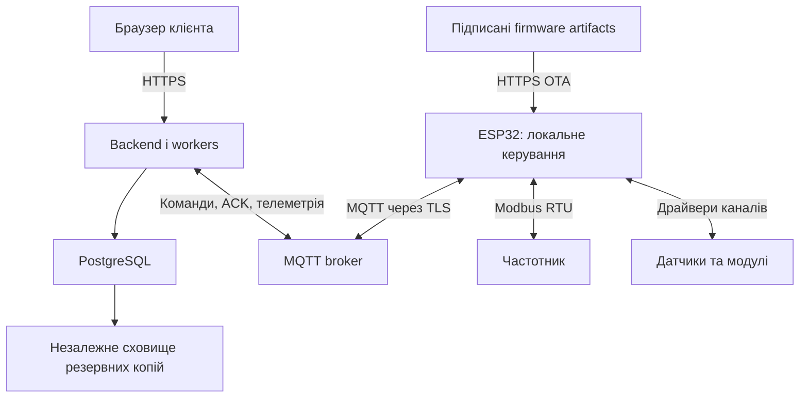

# KERUMO — план готовності продукту v1

Початковий план: **29.09.2026, Europe/Kyiv**. Історична база репозиторію:
`f2fb50b2396ddb905485f61a4700afa32f0470f1`, перевірений виконуваний код
frontend — `d51841d`. Backend **0.38.0**, PostgreSQL **16**, 17 migrations.

**Статус: запропонований план робіт після тестової бази Етапу 14.**
Цей документ не оголошує production release та не позначає майбутні роботи
виконаними. План P0–P9 має власні ID й не змінює історію приймання 9–14.
Числові цілі нижче — початкові пропозиції для P0, не чинний SLA чи сертифікація.

Мета — продукт, який можна відтворювано зібрати, встановити, безпечно
експлуатувати, оновити, відновити після збою та передати на обслуговування.
Готовність доводиться протоколами перевірок конкретної конфігурації.

## 1. Що вже є, а що належить зробити

| Область | Перевірений стан | Наступна робота |
|---|---|---|
| База даних | PostgreSQL, SQLAlchemy, 18 Alembic migrations; organizations/sites/devices, users/roles/sessions, telemetry/snapshot, commands, alarms, notifications | Модель фізичних модулів, ownership/replacement, production retention, backup/PITR і capacity |
| Backend | Версія застосунку 0.39.0; command v2, sequence/Stop ordering, TTL, пізні ACK/Result, повторна перевірка прав/профілю перед dispatch | Production settings, lifecycle identities, масштабування runtime |
| Frontend | Етапи 9–14 реалізовано; Windows 29.09: gate 14.3–14.4 PASS, SHA checkout не показаний; поточний CI у [аудиті](audit-2026-09-30.md) | Завершення manual acceptance, UX реального обладнання й configuration/provisioning flows |
| Прошивка | Tracked Arduino V3 0.2.1, portable core, native tests та CI compile ESP32-S3; NVS ledger/sequence | Повний hardware fault/soak, modular runtime, OTA; ESP-IDF ще не прийнятий як міграція |
| MQTT | Mosquitto/QoS 1; V3 LAN gateway TLS, device password/ACL, bridge; внутрішній local/demo broker anonymous | Production credentials lifecycle, rotation/revocation, backend transport identity та fleet isolation |
| Модульність | Одна capability кожного типу на Device; фіксовані v1 channel keys | Для двох однотипних датчиків потрібен instance/channel contract через усю систему |
| Runtime | API lifespan запускає MQTT та два фонові workers; MQTT client ID фіксований | Розділити ролі процесів до горизонтального масштабування, перевірити ownership workers |
| Backup | Є перевірене ізольоване demo backup/restore з recovery policy | Production storage, WAL/PITR, захист ключів, виміряні RPO/RTO, restore drill |
| Обладнання | V3 ESP32-S3 N16R8 / SU600: читання, моторне керування й три зупинки прийняті 30.09 у конкретних циклах | Повний BOM/схема захисту, решта fault matrix, незалежні вимірювання й польовий пілот; V4 очікує 4G |

Докази: [Етап 14](dossier-v3.5-stage-14-frontend-test-baseline.md),
[module contract](module-channel-contract-v1.md),
[command v2](command-safety-v2.md),
[backup/restore](backup-restore-v1.md).
Старий [огляд backend після H](backend-review-after-h-2026-09-27.md) містить
корисний backlog, але кожен його пункт треба повторно перевіряти: частину
frontend/command змін уже виконано після дати того огляду.

### Звірення P0–P9 на 30.09.2026

| Пункт | Що вже виконано | Що залишається для закриття |
|---|---|---|
| P0.1 | Windows baseline 29.09; CI та defect audit 30.09 | Точний Windows SHA, решта manual/multi-role/mobile сценаріїв |
| P0.2 | V3 source, N16R8, SU600 profile/pins, показані шильдики двигуна/VFD | Повний BOM/схема захисту та modem revision після доставки |
| P0.3–P0.4 | TTL/Stop/replay правила, три фізичні зупинки | Повна погоджена safety/fault matrix, ADR та межі продукту |
| P1 | Command v2/0018, поточний registry | Instances/channel identity, retention/rollups, compatibility нового config contract |
| P2.1–P2.2 | Ідемпотентна реєстрація V3, TLS/device ACL на gateway | Production enrollment, ротація/відкликання, backend identity; P2.3–P2.4 відкриті |
| P3.1–P3.2 | Arduino build/CI та SU600 read-only перевірені | Повний board acceptance і рішення щодо production framework |
| P3.3–P3.4 | V3 telemetry через Wi-Fi доходить до UI | Додаткові сенсори, повний storage/quality/fault acceptance |
| P4.1–P4.2 | START/STOP/frequency, повторний RUN, NVS ledger; gateway/DISARM/ESP power stop | Вся interlock/fault matrix, точні затримки, фактичне Wi-Fi/RS485 fault injection |
| P4.3 | Не починали для V4 | 4G-модуль ще не отримано |
| P4.4 | Три конкретні цикли зупинки підтверджені | Інші відмови й soak; недіагностований Offline залишається відкритим |
| P5–P9 | Локальна тестова база та план | Production operations, OTA, security/load/soak, пілот, поставка не прийняті |

Жоден великий етап P0–P9 не закрито лише за ознакою наявності прототипу.
[Фізичні докази](dossier-v3-su600-control-bench.md), [реєстр відкритих питань](project-status.md).
Таймери/програми частоти, повний редактор F-параметрів і синхронний
LOCAL/REMOTE hardware switch + сайт залишаються вимогами до майбутньої функціональності.

## 2. Цільова архітектура та межі відповідальності

- **PostgreSQL** зберігає користувачів, права, конфігурації, історію,
  команди та аудит. Браузер і ESP32 не мають прямого DB-доступу.
- **Backend** перевіряє права, валідність даних, формує commands, історію,
  alarms та read models; веде desired configuration.
- **Broker** маршрутизує повідомлення між дозволеними identities/topics.
  Підтвердження MQTT transport не означає виконання команди обладнанням.
- **ESP32** виконує локальні перевірки, опитує обладнання, керує Modbus,
  повідомляє фактичний observed state і applied configuration.
- **VFD і захисні кола** забезпечують функції захисту, визначені схемою
  й виробником. Віддалений web STOP не є незалежним аварійним вимикачем.
- **Object storage** зберігає backup та firmware files із різними доступами.
  База зберігає metadata/hash, а не приватні ключі підпису у звичайних JSON полях.

Для першого пілота frontend/backend/broker можуть працювати на одному
підготовленому сервері з ізольованими сервісами й приватною DB. Це одна точка
відмови; незалежний backup обов'язковий. Managed PostgreSQL або окремий DB host
обираються після оцінки вартості, RPO/RTO та доступних навичок адміністрування.
Високу доступність не можна заявляти лише через Docker restart policy.

## 3. База даних: як відбуватиметься розвиток

### 3.1. PostgreSQL лишається основною БД

Необхідні окремі середовища: local development/demo, тимчасове CI,
staging зі стендовими пристроями та production/pilot з реальними клієнтами.
У кожного — власні credentials, device namespace, broker, DB і backups.
Load/fault tests не спрямовуються на клієнтське середовище.

На новому сервері: створення порожньої БД → міграції → довідники можливостей
→ контрольоване створення першого адміністратора → readiness checks.
Demo seed, demo passwords і simulator до клієнтської БД не переносяться.
Користувач не має вручну створювати таблиці через SQL-редактор.

Для app, migrations та backup задаються окремі DB roles з необхідними
правами. Ліміти connection pools рахуються сумарно для всіх API/worker
процесів із резервом для операційного доступу. Зміна pool size не замінює
виправлення повільних SQL або нескінченних транзакцій.

### 3.2. Модель конструктора

Сьогодні `device_capabilities` має unique `(device_id, capability_id)`, а
pressure v1 — один `pressure.bar`. Це реальне обмеження, а не лише вигляд UI.
Рекомендовано погодити наступний контракт **до закріплення нової прошивки**.
Один v1 controller можна використати для першого read-only вертикального
стенда, але multiple-instance support не слід позначати готовим на цій підставі.

Нижче — концептуальні сутності для P1, не затверджений DDL і не список
таблиць, які вже існують:

| Сутність | Дані та інваріант |
|---|---|
| Логічний вузол/установка | Об'єкт і клієнт; його історія має переживати заміну фізичного контролера |
| Фізичний controller identity | Serial/UID, hardware revision, firmware version, credential identity; serial не є паролем |
| Прив'язка обладнання | Хто, куди й коли встановив controller; одна активна ownership binding, покоління binding |
| `module_instances` | Конкретний встановлений модуль, driver/profile, bus/address; два датчики тиску мають різні instance IDs |
| `channels` | Стабільний channel ID, instance, quantity/type/unit, calibration/range; label не є ідентифікатором |
| `config_revisions` | Desired revision/hash, validated payload, author/time; applied/reported revision та error окремо |
| Credentials metadata | Public certificate/serial/fingerprint, expiry/revocation; private signing keys у відокремленому secret store |
| Firmware releases/jobs | Hardware compatibility, image hash/signature metadata, rollout target/state, observed version |

Рекомендована семантика: заміна датчика тієї самої величини може зберегти
логічний channel, але installation/calibration history має показати зміну
фізичного сенсора. Інша величина/несумісна одиниця — новий channel, без
мовчазного змішування історії. Versioned calibration не переписує raw history.

Передача controller іншому клієнту не є простим `UPDATE site_id`: стара
історія залишається в попередньому tenant, створюється нова binding,
старі credentials/queued commands/configs ізолюються. Команда перевіряє
поточні binding/config generation, а не лише повторно використаний UID.
Правила видалення та збереження audit визначаються до активації delete/transfer UI.

### 3.3. Сумісні міграції

Для кожної зміни: schema design → нова Alembic migration → тест порожньої
БД й upgrade зі snapshot чинної версії → обмежений backfill → перевірка
counts/constraints/tenant boundaries → deployment rehearsal → оновлення.
Застосовані історичні migrations не редагуються.

Перехід v1 → наступний protocol: спочатку backend приймає обидві підтримувані
версії, потім додається нова firmware, після цього оновлюється UI та
перевіряється fleet adoption. Конкретний порядок UI/backend узгоджується
з additive fields; стара версія має залишатися працездатною у вікні rollout.
Невідомі schema versions явно відхиляються, а не вгадуються за payload.

Backfill v1 channel mapping має бути однозначним і детермінованим. Для
великих telemetry tables він виконується контрольованими batches із
вимірюванням locks, I/O і replication/ingestion lag. Destructive cleanup
відкладається до закінчення періоду сумісності. Rollback app можливий лише
поки нова схема/data semantics його підтримують; PITR — окрема recovery
операція з можливими втратами новіших даних, не звичайний спосіб downgrade.

### 3.4. Телеметрія, зберігання та масштаб

Зберігаємо відмінність append-only history і current snapshot; heartbeat
не робить старі показання свіжими. `message_id`, boot `session_id`, `sequence`,
device time та server received time мають різні ролі. Offline backlog не
повинен ставати поточним станом лише тому, що надійшов останнім.

Початкова пропозиція: raw data **7–30 днів**, агрегати до **12 місяців**,
audit/commands/alarms — окрема погоджена retention policy. Це не реалізовані
строки й не автоматичний дозвіл видаляти дані. P0 визначає потреби клієнта,
P1 вимірює storage, P7 перевіряє очищення й графіки на реальному обсязі.

Агрегати зберігають min/max/sum/count та missing/invalid quality; середнє
обчислюється через суму/count валідних samples, не як просте середнє середніх.
Окремо фіксується sample-weighted чи time-weighted семантика. Графіки
читають потрібну деталізацію без сканування всієї сирої історії.

| Пристроїв | Пакет раз на 10 с | Пакетів на добу |
|---:|---:|---:|
| 100 | 10/s | 864 000 |
| 1 000 | 100/s | 8 640 000 |
| 10 000 | 1 000/s | 86 400 000 |

Це арифметика вимог, не benchmark; heartbeat, payload bytes, indexes, WAL,
rollups, replicas і backup додають ресурсів. Розмір пакета та частота
локального опитування не зобов'язані дорівнювати частоті відправлення.

Partitioning обирається після виміру. У PostgreSQL 16 unique/primary key
partitioned table має включати partition key [S1]. Нині `message_id` глобально
unique, є FK `device_states.last_telemetry_id` на `telemetry_messages.id`.
Проста заміна таблиці на date partitions змінить ці гарантії. Потрібен
окремий design для dedup ledger/composite keys/FKs, late packets, retention
та тест повторного `message_id` через межу partitions. Не прибирати
унікальність заради throughput. Retention dedup має покривати допустимий
offline/replay horizon; однієї швидкої вставки недостатньо.

### 3.5. Резервні копії й відновлення

Для production розробляємо physical base backups + безперервне WAL
архівування або еквівалентну перевірену managed PITR-послугу. Логічний
`pg_dump` корисний окремо, але не замінює WAL/PITR [S2]. Backup зберігається
поза основним сервером, шифрується; ключі відновлення доступні незалежно
від зламаного сервера. Перевіряються retention і захист від видалення.

Початкова ціль пілота: **RPO ≤ 15 хв**, **RTO ≤ 2 год** після погодження P0.
RPO — скільки вже прийнятих сервером даних можна втратити; RTO — час
відновлення сервісу. Період offline на controller — інша величина.
RPO залежить від фактично доставлених WAL, а не лише налаштування scheduler.

Restore drill: новий ізольований сервер → restore → data checks →
quarantine publish → reconcile controller state → відкликання/оновлення
застарілих sessions/credentials за policy → контрольований допуск commands.
Відновлена стара queued команда не повинна повторно запустити насос.
Перевіряються також persistent broker sessions/черги та pending edge replies:
одного зупиненого DB dispatcher недостатньо. Restore/re-enrollment має
узгоджену control generation/epoch або інший перевірений механізм відсікання
старих дій; для v1 діють його фактичні обмеження, без вигаданого нового поля.
Використовуємо існуючу demo recovery policy як основу, але перевіряємо її
з фізичним firmware ledger. Restore виконується перед пілотом і регулярно
надалі, наприклад щомісяця; backup jobs та restore мають окремі alerts.

## 4. Прошивка: структура, створення й перевірка

### 4.1. Відтворювана база

Поточний V3 уже має Arduino IDE/CLI project з pinned ESP32 core/libraries,
GPIO/profile, compile CI та фізичним прийманням базових функцій.
Початкова пропозиція ESP-IDF залишається архітектурним варіантом для
майбутньої production firmware, а не завершеною або обов’язковою зараз міграцією.
Перехід потребує окремого рішення й стендового порівняння функцій.

Під час P3.1 перевіряємо точну board revision, flash/PSRAM, GPIO,
UART allocation для modem і RS-485, керування DE/RE, живлення й service port.
Це вхідні дані для partition table, memory budgets та OTA slots, а не
припущення за назвою «ESP32-S3». Результат: `firmware/`, build manifest,
board profiles, examples без secrets, build/flash instructions та CI compile.

### 4.2. Компоненти firmware

| Компонент | Обов'язок і обмеження |
|---|---|
| Board layer | Pins/UART/IO/power/reset; hardware revision profiles |
| Modbus driver | Один власник serial bus, обмежені timeouts/retries, узгоджені baud/parity/address, перевірені register maps |
| Sensor/module registry | Драйвер, instance/channel mapping, range/units/calibration та quality |
| Local control | Manual/remote, interlocks, command execution state machine; незалежність від cloud loop |
| Connectivity manager | Wi-Fi/LTE states, backoff із jitter, bounded reconnect та modem recovery |
| MQTT client | TLS/identity, topic ACL compatibility, schema validation, ACK/Result/outbox |
| Storage | Версійована config, bounded persistent command ledger і окремий telemetry buffer |
| Diagnostics | Reset reason, uptime, free/min heap, stack watermark, queue depth/drop counts, bus/network errors |
| OTA manager | Image verification, inactive slot, self-test/rollback та recovery |

Network callback не виконує довгу Modbus операцію: валідована command
переходить у bounded execution queue, а результат повертається окремо.
FreeRTOS tasks/queues плануються за ownership ресурсів; не створюємо
необмежені tasks/buffers на кожен запит. Watchdog виявляє зависання, але
не замінює незалежні захисні кола й перевірену startup policy.

### 4.3. Порядок інтеграції на стенді

1. USB flash, version/reset diagnostics та self-test без command writes.
2. Read-only Modbus одного підтвердженого VFD; порівняти кожен register
   із manual і дисплеєм, перевірити scaling/endian/error/timeout.
3. Один реальний сенсор; відсутність/обрив/невалідне значення не стають нулем.
4. Wi-Fi → захищений MQTT → current backend → БД → реальний UI.
5. Лише після перевірки локальної safety matrix — commands і readback.
6. LTE через окремий connectivity layer, потім fault/soak/OTA trials.

ESP-Modbus — кандидат для transport layer [S3]; він не знає register map
нашого VFD автоматично. Profile для SU600 не доводить сумісність із SU900
або іншою hardware/firmware revision. Невідомий model/profile блокує writes.
Довільний запис Modbus register із web UI не входить до стандартного control API.

### 4.4. Command lifecycle на фізичному контролері

Перед side effect перевіряються: identity/binding, schema/version, command ID,
строк дії, config revision, дозволений command profile, manual/remote та
локальні interlocks. Не можна подовжувати TTL при MQTT reconnect.
Політика часу при boot/clock loss визначається в P0/P2: без достатньої
впевненості в актуальності command небезпечний remote start/frequency
не допускається; перевірка TLS certificate не вимикається заради підключення.

Узгоджений порядок: перевірка → durable acceptance у ledger → ACK →
локальне виконання → перевірка доступного readback → durable result →
доставка Result. Дублікат уже завершеної команди повертає попередній result,
не повторюючи side effect. Ledger переживає reboot і має перевірені retention,
integrity, bounded capacity та flash wear limits. Переповнення не дозволяє
мовчки забути незавершені небезпечні дії.

**Crash window:** живлення може зникнути після Modbus write, але до запису
result. Ні QoS 1, ні flash ledger не дають загальної гарантії exactly-once
фізичного виконання. Після boot потрібні reconciliation/readback і
command-specific policy; невизначений результат не перетворюється на
автоматичний повтор START. Нинішній backend уже має `result_unknown` та
late-result handling. Edge Result v1 допускає лише succeeded/failed:
семантику нового unknown/reconciliation event потрібно версіонувати, а не
передавати непідтримуваний status або видавати unknown за підтверджений failed.

VFD register write, running bit, фактична output frequency і потік води —
різні докази. Якщо flow sensor відсутній, UI не підтверджує наявність потоку
лише за `pump_running`. Межі readback для start/stop/frequency задаються
профілем обладнання з урахуванням acceleration/deceleration.

### 4.5. Offline storage та 4G

NVS призначаємо для невеликих конфігураційних і службових записів [S4].
Часті telemetry samples не пишемо необмежено в ті самі flash keys.
Для історії — окремий bounded ring buffer/storage layout з виміряним
wear budget. ACK/Result та command ledger мають пріоритет над старою
телеметрією. Після заповнення buffer policy явно визначає, що відкидається;
lost-sample counters і gaps видимі на сервері.

Replay зберігає original message/session/sequence/time, має rate limit,
не блокує свіжі результати й не подає старий стан як актуальний. SQLite
нинішнього Python simulator не є автоматично обраним storage для ESP32.

Для SIM7600 дослідити **esp_modem + PPP** як основний варіант: один
IP/TLS/MQTT stack на ESP32 для Wi-Fi та LTE [S5]. Наявність підтримки сімейства
не підтверджує електричну сумісність конкретної придбаної плати. P0/P3
перевіряють model/revision, UART/USB interface, APN, hardware flow control,
антену, операторську SIM і живлення під transmit peaks. Modem AT fallback
розглядається лише після виміряного обмеження основного варіанта.

Тести: SIM відсутня/PIN, registration denied, weak/no signal, APN error,
DNS/TLS failure, modem hang, reconnect storm, зміна IP. Recovery modem
не має безконтрольно перезавантажувати локальне керування. Частоти опитування,
публікації й diagnostics підбираються разом з data usage та energy budget.

## 5. Device identity, конфігурація та onboarding

Для пілота цільова схема — MQTT через TLS із унікальною device identity;
рекомендований варіант — **mTLS** після bench перевірки certificate lifecycle.
Якщо для раннього лабораторного прототипу обрано TLS + unique secret,
це окреме ADR з обмеженнями, expiry/revocation й планом переходу.
Загальний пароль на всі контролери до клієнтського rollout не допускається.

Broker ACL: controller публікує лише власні telemetry/heartbeat/ACK/Result,
отримує лише власні command/config topics; не обирає іншого tenant через
довільний UID у JSON. Credential identity прив'язується до UID сервером.
Backend credentials мають окрему service role. TLS/auth налаштовуються
також у backend MQTT client, а не лише на broker [S6, S7].

Потік введення в експлуатацію:

1. Створення hardware identity і видача унікального credential через
   контрольований manufacturing/service workflow.
2. Перший USB/service flash із test/production profiles без спільних secrets.
3. Claim/install: уповноважений installer прив'язує пристрій до об'єкта;
   serial або QR самі по собі не доводять право власності. Claim secret
   одноразовий/обмежений у часі, доступні replay/rate-limit checks.
4. Backend видає validated desired config з revision/hash; firmware
   застосовує її атомарно у допустимому стані й повідомляє applied/error.
5. UI показує desired і фактичний стан; перша command дозволяється лише
   після необхідних commissioning checks.

Revision не перевидається з іншим hash. Після DB restore фактична applied
config controller може бути новішою за серверну копію: спочатку reconciliation,
потім нова керована revision. Factory reset не залишає той самий доступ із
порожнім dedup ledger: потрібні відкликання/re-enrollment і нова binding
generation, щоб старий broker backlog не виглядав новими commands.

Config визначає driver, instance/channel mapping, bus addresses, periods,
calibration, дозволені діапазони та профіль поведінки при втраті зв'язку.
Невідомий driver, дубль адреси або несумісний hardware profile відхиляються.
Зміна safety-related settings потребує окремих прав та audit; remote config
не вимикає апаратний захист.

До physical commands погодити policy для revoke/disable після створення
queued command. Рекомендація: повторна перевірка binding/permission/config
перед dispatch, відмова небезпечної queued дії із audit при зміні доступу;
поведінка STOP визначається safety matrix окремо. Dispatch recheck не може
скасувати side effect, який уже почався на edge; локальний режим і міжблокування
мають залишатися авторитетними. Заміна/втрата controller включає відкликання
старого credential, reconciliation pending commands та збереження історії.

## 6. Сервер, runtime і експлуатація

### 6.1. Deployment

Фіксуємо dependencies/hashes та container versions, створюємо immutable
artifact на кожну перевірену revision. Різні configs/secrets для staging
і production; production startup відхиляє demo mode/default secrets,
insecure public origins та некоректні timeout/batch settings.

Reverse proxy завершує HTTPS, коректно передає лише довірені forwarded
headers; private API/DB ports не відкриваються напряму в інтернет. MQTT TLS
доступний лише з потрібною authentication. Backend/frontend працюють з
least-privilege/non-root profiles і resource limits. Secure cookies,
CORS/CSRF/CSP, certificates renewal і адміністративний доступ перевіряються
на цільовому домені. Для адміністративних accounts планується MFA.

Deploy workflow: build/test/scan → staging → smoke/HIL → migration rehearsal
→ backup checkpoint → контрольований deploy → readiness → canary checks
→ спостереження або rollback за визначеним порогом. Купівля сервера,
публічний deployment і операції з обладнанням — окремі дії, цей план їх не виконує.

### 6.2. Процеси та масштабування

Нинішній API lifespan запускає MQTT/command/system-alarm workers і використовує
фіксований MQTT client ID. Простий запуск кількох однакових API workers
може дублювати обробку та конфліктувати за broker session. До масштабування
додаємо окремі entrypoints/ролі API, ingestion, dispatcher/scheduler.
Спільні domain services й repository можна залишити в одному codebase.

Зберегти DB row-level locking, TTL recheck і commit-before-MQTT-ACK.
Для кількох workers спроєктувати явне ownership/lease/sharding з fencing
де потрібно, унікальні broker client IDs та per-device ordering. Окремо
перевірити crash між publish і DB commit, дублікати, starvation і graceful drain.
Не підтверджувати MQTT packet після передачі лише в RAM queue без durable
межі. Topic distribution має зберігати правила boot/session ordering.

Первинний pilot може мати одну ingestion/dispatcher replica з відомим
обмеженням доступності. Вибір додаткової черги/cache/оркестратора робиться
за результатами P7 і потребами відновлення; технічна складність сама по
собі не є доказом надійності.

### 6.3. Спостереження та підтримка

Окремо: liveness процесу, readiness залежностей і бізнесова готовність
керувати пристроєм. Метрики: ingest rate/lag/rejections, queue age,
command acceptance/ACK/result/unknown, offline devices, reconnect rate,
DB pool/locks/disk/WAL/backup age, worker progress, firmware heap/reset reasons.
Діагностичні HTTP endpoints не повинні розкривати secrets або чужі дані.

Structured logs зв'язують request_id/command_id/device/binding/config/firmware
versions без passwords/tokens. Дані з контролера не можна необмежено
використовувати як metric labels. Alerts мають власника, дію, threshold,
dedup і перевірений канал доставки; збій in-app UI не має робити аварійне
операційне сповіщення невидимим. Runbooks: DB full, broker unavailable,
expired certificate, device lost, update failed, restore і security incident.

## 7. OTA та життєвий цикл прошивок

Під час вибору flash layout передбачити два app slots, OTA metadata і
storage для config/ledger. ESP-IDF має механізм перевірки нового app та
rollback після невдалого boot [S8]. Конкретні розміри визначаються після
збірки з TLS/modem/diagnostics і запасом, а не за розміром Wi-Fi прикладу.

Release firmware містить version, hardware compatibility, protocol range,
config schema, Git SHA, hash та signature. Hash забезпечує контроль
цілісності, але сам по собі не доводить автора. Private signing keys
захищені поза git; доступ і використання аудіюються. Transport OTA — HTTPS.
Secure Boot, flash/NVS encryption та ключова політика входять у production
hardware profile [S9]. eFuse/debug/download restrictions можуть бути
незворотними: їх випробовують на окремих платах і лише після перевірки
service/recovery workflow; план не містить команди їх негайного запису.

Rollout: лабораторний controller → мала canary group → обмежений відсоток
fleet → решта після observation window. Автоматична пауза при reset loops,
config failures або втраті telemetry. Локальний self-test не повинен
залежати тільки від тимчасової доступності cloud, інакше network outage
може помилково відкотити працездатний app. Діагностика cloud окрема.

OTA дозволяється у погодженому безпечному стані установки; bootloader/NVS/
partition table updates мають інші power-loss ризики, ніж inactive app slot
[S8]. Для першого rollout обмежити update envelope перевіреним app образом.
Перевірити wrong board, wrong signature, corrupted image, power loss під
час download/first boot, погану config і rollback. Старий app повинен
уміти прочитати допустиму NVS/config версію; eFuse anti-rollback policy
не повинна забороняти обраний дозволений recovery image.

## 8. План виконання P0–P9

Кожна операція дає code/config/docs за потреби, відтворювану перевірку,
revision і список відкритих питань. Виконуємо невеликими порціями, зазвичай
по дві операції, як у попередніх етапах. Часові оцінки встановлюємо після
P0/P3 proof-of-concept; точні тижні зараз приховували б невідомі firmware/BOM ризики.

| Блок і залежність | Чотири операції | Критерій виходу |
|---|---|---|
| **P0 — специфікація**, старт | P0.1 Windows/manual acceptance та defect log; P0.2 inventory/BOM/source першого стенда; P0.3 safety/fault matrix і scope v1; P0.4 ADR, цілі якості та acceptance matrix | Відомі hardware inputs, підтримувані функції й очікувана реакція на кожен клас збою |
| **P1 — дані й контракти**, після P0 | P1.1 identities/instances/channel design; P1.2 versioned MQTT/API/config і migrations; P1.3 retention/rollups/SQL baselines; P1.4 upgrade/backfill/compatibility/tenant tests | Нова модель доведена на двох однакових сенсорах і v1 compatibility, дані не змішуються |
| **P2 — identity/config/access**, після P1 design | P2.1 device enrollment/credentials; P2.2 TLS/ACL та backend client; P2.3 desired/applied config; P2.4 revoke/transfer/queued-command policy | Чужий/відкликаний controller не отримує commands; config застосовується контрольовано |
| **P3 — firmware read path**, після P0 і погодженого P1 contract | P3.1 reproducible ESP-IDF/board build; P3.2 read-only Modbus; P3.3 sensor/quality/storage modules; P3.4 Wi-Fi telemetry → PostgreSQL → UI | Реальні вимірювання правильні, reboot/order/quality contract працює |
| **P4 — commands і LTE**, після P2/P3/safety matrix | P4.1 local control/interlocks; P4.2 durable command ledger/ACK/readback/Result; P4.3 esp_modem/LTE recovery; P4.4 power/network/bus fault injection | Немає необґрунтованого повтору дій; unknown показано чесно; локальна поведінка підтверджена |
| **P5 — експлуатаційний стенд**, після P0, інтеграція з P1/P2 | P5.1 locked deployment/secrets/domain; P5.2 runtime roles/worker ownership; P5.3 backup/PITR/restore; P5.4 monitoring/alerts/runbooks | Стенд розгортається й відновлюється відтворювано; збій виявляється без ручного перегляду logs |
| **P6 — OTA/security profile**, після P2/P3/P5 | P6.1 partitions/compatibility; P6.2 signed images/key storage/device security trial; P6.3 canary/rollback workflow; P6.4 destructive-fault bench checks на виділеному обладнанні | Пошкоджений update не позбавляє контрольованого recovery; fleet rollout можна зупинити |
| **P7 — перевірки продукту**, після P4–P6 | P7.1 full backend/frontend/firmware + HIL regression; P7.2 незалежний security review; P7.3 load/reconnect/soak; P7.4 виправлення та повторна acceptance | Немає відкритих blocker/critical дефектів; заявлена capacity і межі підтверджені |
| **P8 — польовий пілот**, після P7 | P8.1 installer/customer onboarding; P8.2 обмежені установки; P8.3 журнал дефектів і UX; P8.4 update/replacement/revocation/restore drill | Інший користувач справляється з інструкцією; польові проблеми відтворені й виправлені |
| **P9 — готовність до поставки**, після P8 і hardware assessment | P9.1 BOM/assembly/end-of-line QA; P9.2 технічні й застосовні conformity trials; P9.3 version manifest/support/release dossier; P9.4 окреме рішення про обмежений commercial rollout | Є повторювана збірка, сервіс, докази випробувань та погоджені експлуатаційні межі |

Критична послідовність: P0 → contract P1 → P2/P3 → P4 → P7 → P8 → P9.
P5 можна готувати паралельно з firmware, P6 — після стабільного app/storage
layout; усі prerequisites P7 мають бути завершені. Це залежності робіт,
а не доручення запускати паралельних агентів чи міняти кілька шарів без перевірок.

## 9. Матриця якості та випробувань

| Перевірка | Очікуваний доказ |
|---|---|
| API/DB | Tenant isolation, constraints, exact fixture migrations, concurrent writes, idempotency, query plans на потрібному обсязі |
| Protocol | Version matrix backend/firmware/UI; malformed/oversize/unknown payload; duplicate/out-of-order/old boot; unknown config |
| HIL — hardware in the loop | Сценарій з реальним ESP32/VFD, збережені traces і readback; software simulator не підміняє цей gate |
| Втрата зв'язку | Wi-Fi/LTE/MQTT/RS-485 окремо; safety matrix виконується, UI не показує stale як fresh |
| Reboot/crash | Контрольовані power cuts у точках acceptance/write/result/config/update; дедуплікація та unknown outcome |
| Tenant/ownership | Повторний claim, stolen serial/QR, revoked cert, transfer/replacement; історія попереднього клієнта не розкривається |
| Browser | Windows Chrome/Edge, Android Chrome, iOS Safari за заявленою support matrix; F5/back/two tabs, zoom/keyboard/AT |
| Restore | Перевірені дані й досягнуті RPO/RTO; старі command/session не повертаються до виконання/доступу |
| Load | 100 → 1 000 → 10 000 simulated devices як окремі capacity levels; representative payload/history/rules/users; не обов'язок продавати 10k capacity у першому пілоті |
| Long run | Початково 72 h bench, далі 3–5 pilot devices протягом 2–4 тижнів; measured heap/queues/flash writes/reboots, а не лише uptime |
| OTA | Wrong target/signature, перерване оновлення, boot failure, config rollback, staged rollout і certificate rotation |
| Hardware | Живлення під peak load, ізоляція/захист, temperature, монтаж, кабелі/antenna, EMC і потрібні випробування за оцінкою профільного спеціаліста |

Фізичні fault tests проводяться на придатному стенді з перевіркою силової
частини спеціалістом. Результат «зупинитися при будь-якій втраті інтернету»
не є універсально правильною політикою: для конкретної установки визначають
керований stop/continue/local-control, блокування й умови restart.
Властивості корпусу після свердління, IP/температурні заяви й відповідність
вимогам цільового ринку потребують доказів; цей план не є правовим висновком.

Початкові SLO для погодження: p95 звичайного API read ≤ 500 ms на заданому
наборі даних і concurrency; p95 прийняття command сервером ≤ 1 s без часу
фізичного виконання. End-to-end ACK/Result deadlines, telemetry freshness
та offline buffer horizon визначаються окремо для Wi-Fi/LTE/VFD profile.
Показники вимірюються на ідентифікованому host/build/DB volume/network.
Додатково p99, error rate, accepted-but-lost messages, replay duplicates,
queue age й recovery time. 0 unintended actuation і 0 tenant data leakage
є блокувальними вимогами сценаріїв, а не статистичною гарантією нульового ризику.

## 10. Як виглядатиме одна практична операція

1. Фіксуємо мету, вихідний commit, hardware/config і критерій PASS.
2. Реалізуємо вузьку зміну й tests; оновлюємо versioned contract за потреби.
3. CI виконує потрібні suites; hardware tests виконуються на визначеному
   стенді. Skipped hardware test не видається за PASS.
4. Користувач отримує один PowerShell/build/flash block з поясненням
   очікуваного результату. Для фізичних змін спочатку підтверджується
   точна плата/схема; регістри, pins і силове підключення не вгадуються.
5. Зберігаємо report: commit, firmware hash, schema/config versions,
   test inputs, очікуване/фактичне, traces/screenshots, defects і межі.
6. Операція отримує acceptance лише після потрібного machine + manual/HIL
   доказу. Code complete, CI passed, bench accepted і pilot accepted — різні стани.

Ролі: асистент готує code/contracts/scripts/docs і доступні CI перевірки;
користувач виконує Windows/physical checks та продуктові рішення;
профільний інженер перевіряє силову частину/assembly; зовнішній reviewer
перевіряє security/operations перед commercial rollout. Один власник може
координувати проєкт, але незалежні перевірки критичних частин потрібні.

## 11. Перші дві операції та потрібні вхідні дані

**P0.1:** новий Windows gate 14.3–14.4, потім один acceptance checklist
з попередніх відкритих manual сценаріїв. Вихід: baseline SHA та defect log.

Оновлення 29.09.2026: Windows automatic gate підтверджений вісьмома
скриншотами — 152 mocked / 10 live / фінальний PASS, budget PASS, audit 0.
[Докази](stage-14-op4-test-baseline.md#21-windows-докази-29092026).
SHA checkout і залишок ручних сценаріїв ще потрібні; P0.1 виконана частково.

**P0.2:** паспорт першого стенда: точна ESP32-S3 board/flash/PSRAM,
модель і revision modem, модель VFD та її manual, RS-485 converter,
джерела живлення, установлені sensors, наявний Arduino source і фактичні
pins/serial settings. Для відсутніх даних записується «потребує підтвердження».
Вихід: BOM/pin/resource map і перелік того, що можна перевіряти read-only.

Далі P0.3/P0.4 визначають безпечну поведінку й scope, після них P1.1/P1.2
формалізують DB/protocol design. Перша вертикаль **SU600 → ESP32 → TLS MQTT → PostgreSQL → UI** уже
підтверджена на V3; також виконано базові physical writes. Це не закриває
контракт multiple-instance, LTE або всі production interlocks.

До завершення P0 не встановлюємо остаточну дату продажу, server sizing,
flash partitions або точні costs. V5 PCB розробляється після стабілізації
інтерфейсів/живлення/BOM на V4, із test points та service/recovery шляхом.

## 12. Первинні технічні джерела

Перевірено 29.09.2026. Framework/components pin-яться під час реалізації;
URL `stable/latest` може пізніше показувати іншу версію.

- **S1:** [PostgreSQL 16 — partitioning і limitations](https://www.postgresql.org/docs/16/ddl-partitioning.html).
- **S2:** [PostgreSQL 16 — continuous archiving/PITR](https://www.postgresql.org/docs/16/continuous-archiving.html).
- **S3:** [Espressif ESP-Modbus](https://github.com/espressif/esp-modbus).
- **S4:** [ESP32-S3 — NVS](https://docs.espressif.com/projects/esp-idf/en/stable/esp32s3/api-reference/storage/nvs_flash.html).
- **S5:** [Espressif esp_modem](https://docs.espressif.com/projects/esp-protocols/esp_modem/docs/latest/index.html).
- **S6:** [Mosquitto — Dynamic Security](https://mosquitto.org/documentation/dynamic-security/).
- **S7:** [Mosquitto — TLS](https://mosquitto.org/man/mosquitto-tls-7.html).
- **S8:** [ESP32-S3 — OTA і rollback](https://docs.espressif.com/projects/esp-idf/en/stable/esp32s3/api-reference/system/ota.html).
- **S9:** [ESP32-S3 — security overview](https://docs.espressif.com/projects/esp-idf/en/stable/esp32s3/security/security.html).
- Додаткові verification орієнтири: [OWASP ASVS](https://owasp.org/www-project-application-security-verification-standard/),
  [NIST IoT cybersecurity capabilities](https://pages.nist.gov/IoT-Device-Cybersecurity-Requirement-Catalogs/technical/).

## 13. Пов'язані документи проєкту

- [Досьє Етапу 14](dossier-v3.5-stage-14-frontend-test-baseline.md).
- [Windows gate 14.3–14.4](stage-14-op4-test-baseline.md).
- [Модулі/канали v1](module-channel-contract-v1.md).
- [Telemetry v1](telemetry-contract-v1.md), [session protection](telemetry-session-protection-v1.md).
- [Commands](mqtt-command-protocol-v1.md), [ACK](mqtt-command-ack-v1.md), [Result](mqtt-command-result-v1.md), [reliability](command-reliability-v1.md).
- [Demo backup/restore](backup-restore-v1.md).
