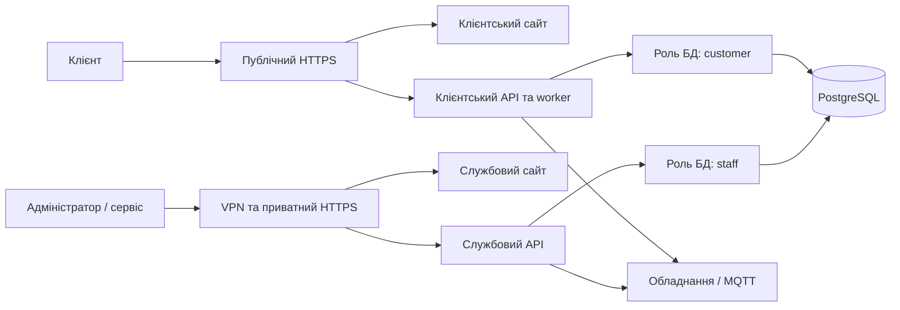

# Один сервер, два застосунки, приватний доступ персоналу

Для закритого пілота використовуйте `compose.pilot.yml` на Linux Docker host. Це **підготовлена схема розгортання**, а не вже увімкнений VPN на вашому сервері. Клієнтський сайт доступний через HTTPS; службовий застосунок через Tailscale Serve лише членам дозволеної VPN-групи. БД, брокер і API не мають публічних host ports.



## Перше встановлення

Потрібні домен клієнтського сайту з DNS на сервер, Docker Compose, встановлений на host Tailscale з MagicDNS/HTTPS і доступ до його адміністративних налаштувань. Встановлення Tailscale й додавання машини до вашого tailnet потребують вашого облікового запису; репозиторій не містить VPN credentials.

У tailnet дозволяйте TCP 443 цього host тільки групам адміністратора й сервісу. Звичайна default allow-all policy Tailscale для цього недостатня. Забороніть доступ іншим користувачам і переконайтеся, що тестова стороння identity не проходить. Не вмикайте Tailscale Funnel: він зробив би endpoint публічним. Адміністрація VPN окрема від ролей продукту: доступ через VPN ще не авторизує операції в панелі.

На сервері в checkout:

```bash
mkdir -m 700 -p .local/pilot-bootstrap
python3 scripts/prepare-pilot.py \
  --customer-host app.your-domain.example \
  --staff-url https://your-host.your-tailnet.ts.net
```

Замініть обидві адреси своїми. Скрипт створює `.env.pilot` з правами `0600` і різними випадковими паролями/ключами. Наявний файл не перезаписується. Не використовуйте його для ротації діючих secrets. Для перенесення чинної БД збережіть account key і використовуйте [backup/restore](backup-restore-v1.md), а не новий account secret.

```bash
docker compose --env-file .env.pilot -f compose.pilot.yml --profile tools build migrator customer-web staff-web
docker compose --env-file .env.pilot -f compose.pilot.yml up -d --wait postgres mosquitto
docker compose --env-file .env.pilot -f compose.pilot.yml run --rm migrator alembic upgrade head
docker compose --env-file .env.pilot -f compose.pilot.yml run --rm migrator \
  python -m app.tools.install_runtime_roles --rules /rules/runtime-roles.sql
```

APIs працюють через `kerumo_customer` і `kerumo_staff`, які не є DB owner/superuser. Owner `kerumo_migrator` доступний тільки одноразовому setup/migration container. Для наступних міграцій після upgrade повторіть `install_runtime_roles`, щоб оновити grants/policies для нових таблиць; він використовує паролі з чинного приватного environment.

Якщо в БД ще немає головного адміністратора:

```bash
docker compose --env-file .env.pilot -f compose.pilot.yml run --rm migrator \
  python -m app.tools.bootstrap_staff --email administrator@your-domain.example \
  --output /private/first-administrator.json
```

Файл `.local/pilot-bootstrap/first-administrator.json` містить початковий пароль. Він створюється один раз із правами `0600`; чинні акаунти не змінюються, якщо адміністратор уже є. Подальші запрошення, ролі й об’єкти керуються через панель. Після першого входу збережіть recovery key, налаштуйте Authenticator і замініть початковий пароль у «Моя безпека».

```bash
docker compose --env-file .env.pilot -f compose.pilot.yml up -d --wait \
  backend staff-backend customer-web staff-web customer-edge staff-edge
sudo tailscale serve --bg http://127.0.0.1:3001
tailscale serve status
```

`staff-edge` слухає тільки `127.0.0.1:3001`. Tailscale Serve завершує TLS і пересилає приватний HTTPS трафік на цей loopback endpoint. `STAFF_PUBLIC_URL`, CORS Origin і URL, запечений у staff build, мають збігатися з реальною Serve адресою. Зміна адрес потребує перебудови frontend. Публічними відкривайте тільки 80/443 Caddy і, за фізичної установки, окремий захищений controller gateway.

Якщо підмережі `172.29.112.0/24` або `172.29.113.0/24` зайняті, змініть compose networks і trusted proxy IP у command/config разом. API довіряють forwarded IP лише відповідному reverse proxy; Nginx приймає forwarded IP від host bridge, а потім переписує upstream header. Це працює для наведеної схеми, не для довільного зовнішнього проксі. Звірте IP у журналі з адресою свого VPN-клієнта перед використанням IP для розслідувань.

## SMTP і контролери

У початковому production environment `MAIL_DELIVERY_MODE=disabled`: клієнтська реєстрація/запрошення повідомлять про недоступність надсилання, а не удаватимуть доставку. Приватно додайте SMTP host, username/password, узгоджені MAIL_FROM та TLS mode, встановіть `MAIL_DELIVERY_MODE=smtp`, перевідтворіть обидва API. Перевірте надходження листа й callback URL у себе. [Контракт пошти](personal-accounts-v1.md).

Внутрішній Mosquitto використовується для telemetery worker. Фізична активація додатково потребує чинного Dynamic Security controller gateway, його admin password, TLS і public MQTT address. `compose.pilot.yml` **не створює автоматично** gateway; підключіть його до `equipment` network і налаштуйте змінні з template. [Підготовка gateway та стенду](v3-su600-bench.md), [активація](stage2-acceptance.md). Не спрямовуйте обладнання на відкритий анонімний broker.

## Перевірка меж доступу

- Поза VPN приватна Serve адреса недоступна. Через VPN identity без дозволу теж недоступна.
- На клієнтському домені `/operations`, `/factory`, `/api/v1/staff/users` і `/api/v1/factory/controllers` повертають 404.
- Клієнтський акаунт не входить у staff API; службовий не входить у customer API. Refresh cookie/access token одного застосунку не авторизує інший.
- Після входу нового персоналу без MFA доступна тільки особиста безпека до підтвердження коду. Для sensitive admin actions потрібні причина, поточний пароль і **свіжий** OTP.
- Сервіс бачить лише явно призначені організації/об’єкти; головний адміністратор може скасувати його доступ.
- У production customer DB role не читає staff password/security/session рядки і не може підвищити глобальну роль. Worker отримує лише безпечні metadata автора для сервісного розкладу, після чого перевіряє чинні scope/expiry.
- Обидві runtime DB roles не можуть видаляти чи змінювати audit rows. DB owner може, тому потрібні приватні backups/зовнішнє зберігання журналів.
- Логи login, recovery й інших запитів не містять тіла, OTP, пароль, query secrets чи raw token URL. JSON logs містять route template, status, latency, request ID та IP. Логи Nginx/Caddy за замовчуванням у цьому config не вмикають URL access logging.

## Експлуатація й межі одного сервера

Операції з людьми, об’єктами, ролями й обладнанням виконуються у панелі. Довільний web-terminal і Docker socket навмисно не надаються. Службовий frontend не знає DB/JWT/SMTP secrets. Резервні копії містять приватні дані: доступ обмежений, зберігання поза сервером, регулярна перевірка відновлення. Одноразовий reset demo з [локальної інструкції](staff-console-v1.md) не призначений для production БД.

Для host CPU, мережі, довгих історій й alerts використовуйте окремий Prometheus/node_exporter + Grafana або ваш інфраструктурний сервіс моніторингу; їх credentials/інсталяція не входять у цю панель. Збирайте structured logs зовнішнім collector з обмеженим доступом і retention policy. Docker JSON logs тут обмежені `10m × 5` на сервіс, щоб не заповнювати диск безмежно.

Один host залишається спільною точкою відмови. VPN та окремі DB credentials зменшують доступність і наслідки окремих компрометацій; вони не захищають службову частину від захоплення root/kernel самого host. Клієнтський API має потрібні права роботи з клієнтським обладнанням, тому його повний злам може зачепити цю частину даних. Для сильнішої ізоляції надалі винесіть службове середовище й журнали на окрему машину/мережу.
